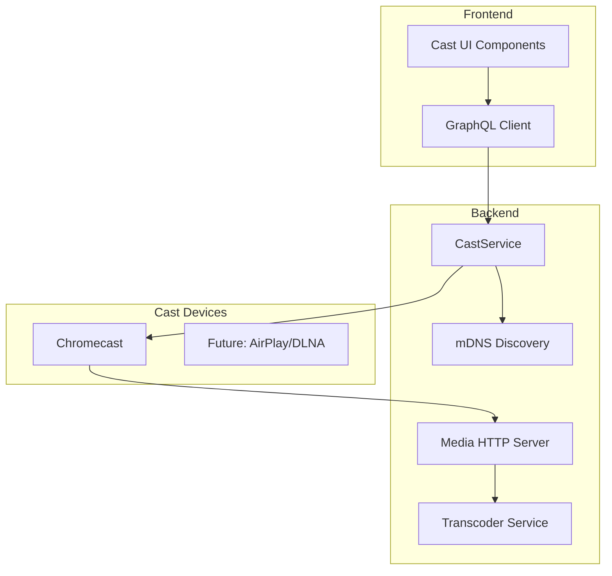

# Chromecast Casting Feature Implementation Plan

## Architecture Overview



## Phase 1: Backend Cast Service

### 1.1 Add Dependencies

Add to [backend/Cargo.toml](backend/Cargo.toml):

```toml
# Chromecast casting
rust_cast = "0.21"

# mDNS device discovery  
mdns-sd = "0.11"
```

### 1.2 Create Cast Service Module

Create `backend/src/services/cast.rs` with:

- **CastDevice struct** - Represents a discovered/connected cast device
- **CastSession struct** - Active casting session with playback state
- **CastService** - Main service managing devices and sessions
  - `discover_devices()` - mDNS scan for Chromecast devices
  - `add_device_manual(ip, port, name)` - Manual device addition
  - `connect(device_id)` - Establish connection to device
  - `disconnect(device_id)` - Close connection
  - `load_media(device_id, media_url, media_type)` - Start casting
  - `play/pause/stop/seek(session_id)` - Playback control
  - `set_volume(session_id, level)` - Volume control
  - `get_status(session_id)` - Get current playback state

Key types:

```rust
pub struct CastDevice {
    pub id: String,
    pub name: String,
    pub address: IpAddr,
    pub port: u16,
    pub model: Option<String>,
    pub is_connected: bool,
}

pub struct CastPlaybackState {
    pub session_id: String,
    pub device_id: String,
    pub media_id: String,
    pub player_state: PlayerState, // Idle, Buffering, Playing, Paused
    pub current_time: f64,
    pub duration: Option<f64>,
    pub volume: f32,
    pub is_muted: bool,
}
```

### 1.3 Media Streaming Endpoint

Add REST endpoint in [backend/src/api/mod.rs](backend/src/api/mod.rs):

- `GET /media/:file_id/stream` - Direct file streaming with Range header support
- `GET /media/:file_id/transcode/:profile` - Transcoded stream (HLS or direct)

The endpoint will:

1. Resolve file path from database
2. Check codec compatibility with Chromecast
3. Serve directly if compatible (MP4/H.264/AAC)
4. Trigger transcoding if needed (VP9, HEVC to H.264)

Chromecast compatible formats:

- Video: H.264 (MP4), VP8 (WebM)
- Audio: AAC, MP3, Opus
- Container: MP4, WebM, MKV (limited)

### 1.4 Enhance Transcoder

Extend [backend/src/media/transcoder.rs](backend/src/media/transcoder.rs):

- Add compatibility checking based on Chromecast supported formats
- Add real-time transcoding for incompatible formats
- Cache transcoded segments for performance

## Phase 2: GraphQL API

### 2.1 Types

Add to [backend/src/graphql/types.rs](backend/src/graphql/types.rs):

```rust
// Device discovered on network
pub struct CastDevice {
    pub id: String,
    pub name: String,
    pub address: String,
    pub port: i32,
    pub model: Option<String>,
    pub is_connected: bool,
    pub device_type: CastDeviceType, // Chromecast, ChromecastAudio, etc.
}

pub enum CastDeviceType {
    Chromecast,
    ChromecastAudio,
    GoogleHome,
    Unknown,
}

// Active playback session
pub struct CastSession {
    pub id: String,
    pub device_id: String,
    pub media_id: String,
    pub stream_url: String,
    pub player_state: CastPlayerState,
    pub current_time: f64,
    pub duration: Option<f64>,
    pub volume: f32,
    pub is_muted: bool,
    pub started_at: String,
}

pub enum CastPlayerState {
    Idle,
    Buffering,
    Playing,
    Paused,
}
```

### 2.2 Queries

```graphql
# List discovered cast devices
castDevices: [CastDevice!]!

# Get active cast sessions
castSessions: [CastSession!]!

# Get a specific session
castSession(id: ID!): CastSession
```

### 2.3 Mutations

```graphql
# Trigger device discovery scan
discoverCastDevices: [CastDevice!]!

# Manually add a device by IP
addCastDevice(input: AddCastDeviceInput!): CastDeviceResult!

# Remove a saved device
removeCastDevice(id: ID!): MutationResult!

# Start casting media to a device
castMedia(input: CastMediaInput!): CastSessionResult!

# Playback controls
castPlay(sessionId: ID!): CastSessionResult!
castPause(sessionId: ID!): CastSessionResult!
castStop(sessionId: ID!): MutationResult!
castSeek(sessionId: ID!, position: Float!): CastSessionResult!
castSetVolume(sessionId: ID!, volume: Float!): CastSessionResult!
castSetMuted(sessionId: ID!, muted: Boolean!): CastSessionResult!
```

Input types:

```graphql
input AddCastDeviceInput {
    address: String!
    port: Int
    name: String
}

input CastMediaInput {
    deviceId: ID!
    mediaFileId: ID!
    startPosition: Float  # Optional start time in seconds
}
```

### 2.4 Subscriptions

```graphql
# Real-time playback status updates
castSessionUpdated(sessionId: ID): CastSession!

# Device availability changes
castDevicesChanged: [CastDevice!]!
```

## Phase 3: Frontend Integration

### 3.1 Cast Context Provider

Create `frontend/src/lib/cast-context.ts`:

- React context for cast state management
- Available devices list
- Active session tracking
- Subscription to real-time updates

### 3.2 Cast Button Component

Create `frontend/src/components/CastButton.tsx`:

- Cast icon button (using `IconCast` from Tabler)
- Dropdown showing available devices
- Visual indicator when casting is active
- Uses HeroUI Dropdown and Popover components

### 3.3 Cast Control Bar

Create `frontend/src/components/CastControlBar.tsx`:

- Appears when casting is active
- Shows current media, device name
- Play/pause, seek slider, volume controls
- Stop casting button

### 3.4 Integration Points

- **VideoPlayer component** - Add cast button option
- **Episode table** - Add "Cast" row action
- **Show detail page** - Cast episode from actions dropdown
- **Navbar** - Global cast indicator when active

## Phase 4: Database Schema

### 4.1 Migration

Create `backend/migrations/014_cast_devices.sql`:

```sql
-- Saved cast devices (for manual entries and favorites)
CREATE TABLE cast_devices (
    id UUID PRIMARY KEY DEFAULT gen_random_uuid(),
    name TEXT NOT NULL,
    address INET NOT NULL,
    port INTEGER NOT NULL DEFAULT 8009,
    model TEXT,
    device_type TEXT NOT NULL DEFAULT 'chromecast',
    is_favorite BOOLEAN NOT NULL DEFAULT false,
    last_seen_at TIMESTAMPTZ,
    created_at TIMESTAMPTZ NOT NULL DEFAULT NOW(),
    updated_at TIMESTAMPTZ NOT NULL DEFAULT NOW()
);

-- Cast session history (for analytics/resume)
CREATE TABLE cast_sessions (
    id UUID PRIMARY KEY DEFAULT gen_random_uuid(),
    device_id UUID REFERENCES cast_devices(id) ON DELETE SET NULL,
    media_file_id UUID REFERENCES media_files(id) ON DELETE SET NULL,
    episode_id UUID REFERENCES episodes(id) ON DELETE SET NULL,
    started_at TIMESTAMPTZ NOT NULL DEFAULT NOW(),
    ended_at TIMESTAMPTZ,
    last_position FLOAT,
    created_at TIMESTAMPTZ NOT NULL DEFAULT NOW()
);
```

## Implementation Order

1. **Backend Core** (Phase 1)

   - Add rust_cast and mdns-sd dependencies
   - Create CastService with basic device discovery
   - Implement media streaming endpoint

2. **GraphQL API** (Phase 2)

   - Add cast types
   - Implement queries and mutations
   - Add subscriptions for real-time updates

3. **Database** (Phase 4)

   - Add migration for device storage
   - Create repository layer

4. **Frontend** (Phase 3)

   - Cast context and hooks
   - UI components
   - Integration with existing pages

## Future Extensibility

The architecture supports adding other cast protocols:

- **AirPlay** - Use `airplay2-rs` crate or similar
- **DLNA/UPnP** - Use `rupnp` crate for discovery and control
- **Spotify Connect** - For music library casting

Each protocol would implement a common `CastProtocol` trait:

```rust
#[async_trait]
pub trait CastProtocol {
    async fn discover_devices(&self) -> Result<Vec<CastDevice>>;
    async fn connect(&self, device: &CastDevice) -> Result<()>;
    async fn load_media(&self, url: &str, media_type: &str) -> Result<CastSession>;
    async fn play(&self) -> Result<()>;
    async fn pause(&self) -> Result<()>;
    async fn seek(&self, position: f64) -> Result<()>;
    async fn stop(&self) -> Result<()>;
    async fn get_status(&self) -> Result<PlaybackState>;
}
```

## Key Files to Create/Modify

| File | Action |

|----|---|

| `backend/Cargo.toml` | Add rust_cast, mdns-sd dependencies |

| `backend/src/services/cast.rs` | New - CastService implementation |

| `backend/src/services/mod.rs` | Export cast module |

| `backend/src/api/media.rs` | New - Media streaming endpoint |

| `backend/src/api/mod.rs` | Register media routes |

| `backend/src/graphql/types.rs` | Add cast types |

| `backend/src/graphql/schema.rs` | Add cast queries/mutations |

| `backend/src/graphql/subscriptions.rs` | Add cast subscriptions |

| `backend/src/media/transcoder.rs` | Enhance for cast compatibility |

| `backend/migrations/014_cast_devices.sql` | New - Device storage |

| `frontend/src/lib/cast-context.ts` | New - Cast state management |

| `frontend/src/components/CastButton.tsx` | New - Cast button |

| `frontend/src/components/CastControlBar.tsx` | New - Playback controls |

| `frontend/src/lib/graphql/types.ts` | Add cast types |

| `frontend/src/lib/graphql/mutations.ts` | Add cast mutations |

| `frontend/src/lib/graphql/subscriptions.ts` | Add cast subscriptions |