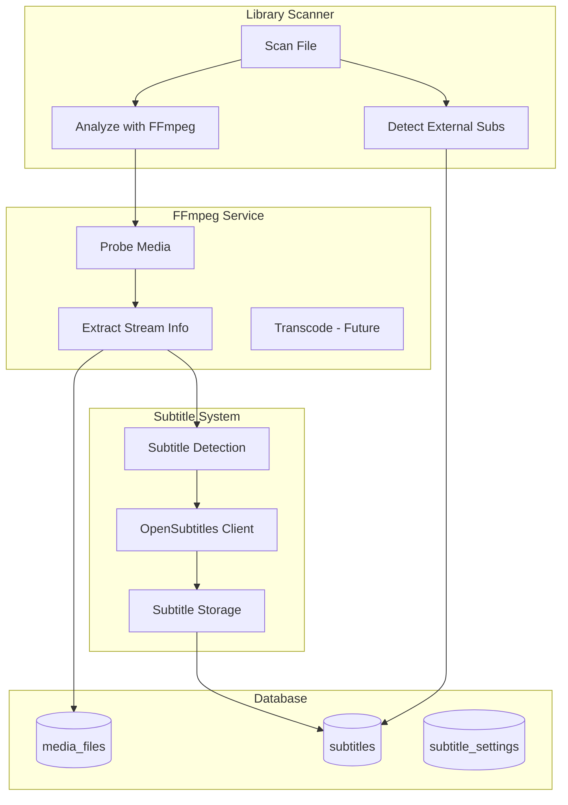
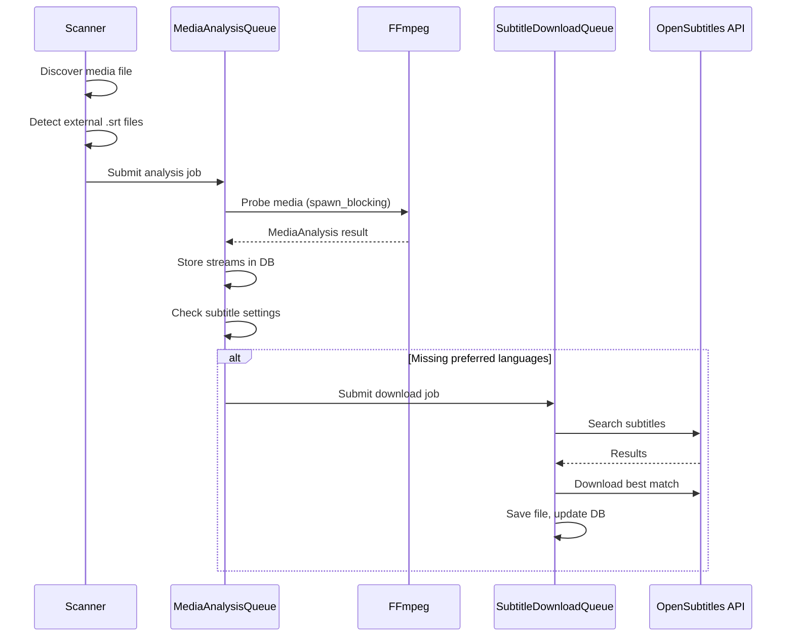

# FFmpeg Integration and Subtitle System

## Architecture Overview



## Job Queue Integration

The existing job queue system in [backend/src/services/job_queue.rs](backend/src/services/job_queue.rs) provides the infrastructure for bounded concurrency. We'll create dedicated queues for each workload type:

### Queue Definitions

```rust
// In backend/src/services/mod.rs or a new queues.rs

/// Media analysis queue - FFmpeg probing operations
/// Low concurrency to avoid overwhelming I/O and CPU
pub type MediaAnalysisQueue = WorkQueue<MediaAnalysisJob>;

pub struct MediaAnalysisJob {
    pub media_file_id: Uuid,
    pub path: PathBuf,
}

pub fn create_media_analysis_queue(ffmpeg: Arc<FfmpegService>, db: Database) -> MediaAnalysisQueue {
    WorkQueue::new(
        "media_analysis",
        JobQueueConfig {
            max_concurrent: 2,  // FFmpeg is CPU-intensive
            queue_capacity: 500,
            job_delay: Duration::from_millis(100),
        },
        move |job: MediaAnalysisJob| {
            let ffmpeg = ffmpeg.clone();
            let db = db.clone();
            async move {
                // Analyze and update database
            }
        },
    )
}

/// Subtitle download queue - OpenSubtitles API calls
/// Very low concurrency due to API rate limits
pub type SubtitleDownloadQueue = WorkQueue<SubtitleDownloadJob>;

pub struct SubtitleDownloadJob {
    pub media_file_id: Uuid,
    pub episode_id: Option<Uuid>,
    pub languages: Vec<String>,
    pub imdb_id: Option<String>,
}

pub fn create_subtitle_download_queue(
    opensubtitles: Arc<OpenSubtitlesClient>,
    db: Database,
) -> SubtitleDownloadQueue {
    WorkQueue::new(
        "subtitle_download",
        JobQueueConfig {
            max_concurrent: 1,  // Strict rate limiting for API
            queue_capacity: 200,
            job_delay: Duration::from_secs(2),  // API allows ~1 req/sec
        },
        move |job: SubtitleDownloadJob| {
            let client = opensubtitles.clone();
            let db = db.clone();
            async move {
                // Search and download subtitles
            }
        },
    )
}
```

### Queue Usage Patterns

| Operation | Queue Type | Concurrency | Notes |

|-----------|-----------|-------------|-------|

| FFmpeg media analysis | `MediaAnalysisQueue` | 2 | CPU-intensive, I/O heavy |

| OpenSubtitles search | `MetadataQueue` | 1 | API rate limited |

| Subtitle download | `SubtitleDownloadQueue` | 1 | Daily quota limits |

| Batch file scanning | `ConcurrencyLimiter` | 10 | File I/O operations |

### Scanner Integration

The scanner will submit jobs to queues rather than processing inline:

```rust
// After discovering a new media file
media_analysis_queue.submit(MediaAnalysisJob {
    media_file_id: file.id,
    path: file.path.clone().into(),
}).await?;

// After analysis, if subtitles needed
if settings.auto_download && missing_languages.is_not_empty() {
    subtitle_download_queue.submit(SubtitleDownloadJob {
        media_file_id: file.id,
        episode_id: file.episode_id,
        languages: missing_languages,
        imdb_id: show.imdb_id.clone(),
    }).await?;
}
```

## Phase 1: FFmpeg Integration

### Add ffmpeg-next Dependency

Update [backend/Cargo.toml](backend/Cargo.toml):

```toml
ffmpeg-next = "7"
```

Note: Requires FFmpeg 7.x libraries installed on the system. The crate is synchronous, so we'll wrap calls with `spawn_blocking`.

### Create FFmpeg Service

New file: `backend/src/services/ffmpeg.rs`

Core functionality:

- `probe_media(path: &Path) -> Result<MediaAnalysis>` - Extract all stream information
- `MediaAnalysis` struct containing:
  - `duration_secs: f64`
  - `bitrate: Option<i64>`
  - `video_streams: Vec<VideoStream>` - codec, resolution, HDR type, bitrate, frame rate
  - `audio_streams: Vec<AudioStream>` - codec, channels, language, bitrate
  - `subtitle_streams: Vec<SubtitleStream>` - codec/format, language, forced flag, title

Key patterns:

- Use `tokio::task::spawn_blocking` to run FFmpeg operations off the async runtime
- Parse HDR metadata (HDR10, Dolby Vision, HLG) from color transfer/primaries
- Extract language tags from stream metadata
- All analysis calls go through `MediaAnalysisQueue` for bounded concurrency (max 2 concurrent)

### Enhance MediaFileRecord

Update [backend/src/db/media_files.rs](backend/src/db/media_files.rs) to store detailed analysis:

- `frame_rate: Option<String>`
- `video_bitrate: Option<i32>` (already exists)
- `audio_bitrate: Option<i32>`
- `audio_channels: Option<String>` (already exists)
- `audio_language: Option<String>` (already exists)
- `analyzed_at: Option<DateTime<Utc>>` - track when last analyzed

Migration: `backend/migrations/017_media_analysis.sql`

## Phase 2: Subtitle Detection

### Database Schema

New migration: `backend/migrations/018_subtitles.sql`

```sql
-- Subtitle records (embedded or external)
CREATE TABLE subtitles (
    id UUID PRIMARY KEY DEFAULT gen_random_uuid(),
    media_file_id UUID NOT NULL REFERENCES media_files(id) ON DELETE CASCADE,
    
    -- Source type
    source_type TEXT NOT NULL, -- 'embedded', 'external', 'downloaded'
    
    -- For embedded: stream index; for external/downloaded: file path
    stream_index INTEGER,
    file_path TEXT,
    
    -- Metadata
    language TEXT, -- ISO 639-1 code (en, es, fr)
    format TEXT, -- srt, ass, vtt, subrip, hdmv_pgs_subtitle, etc.
    title TEXT, -- Stream title if present
    is_forced BOOLEAN DEFAULT false,
    is_hearing_impaired BOOLEAN DEFAULT false,
    is_default BOOLEAN DEFAULT false,
    
    -- For downloaded subtitles
    opensubtitles_id TEXT,
    downloaded_at TIMESTAMPTZ,
    
    created_at TIMESTAMPTZ DEFAULT NOW(),
    updated_at TIMESTAMPTZ DEFAULT NOW()
);

CREATE INDEX idx_subtitles_media_file ON subtitles(media_file_id);
CREATE INDEX idx_subtitles_language ON subtitles(language);
```

### Subtitle Repository

New file: `backend/src/db/subtitles.rs`

- `list_by_media_file(media_file_id)` - Get all subtitles for a file
- `list_by_episode(episode_id)` - Get subtitles via media file join
- `create(input)` - Create subtitle record
- `delete_by_media_file(media_file_id)` - Clear for re-scan
- `has_language(media_file_id, language)` - Check if language exists

### External Subtitle Detection

In the scanner, detect common subtitle files alongside media:

- Look for `.srt`, `.ass`, `.ssa`, `.vtt`, `.sub`, `.idx` files
- Match by base filename: `Movie.Name.2024.mkv` -> `Movie.Name.2024.en.srt`
- Parse language from filename patterns: `.en.srt`, `.english.srt`, `_eng.srt`

## Phase 3: Subtitle Settings

### Library Settings

Update library schema (migration `018_subtitles.sql`):

```sql
ALTER TABLE libraries ADD COLUMN auto_download_subtitles BOOLEAN DEFAULT false;
ALTER TABLE libraries ADD COLUMN preferred_subtitle_languages TEXT[] DEFAULT '{}';
```

### Show-Level Overrides

Update tv_shows schema:

```sql
ALTER TABLE tv_shows ADD COLUMN subtitle_settings_override JSONB;
-- Structure: { "auto_download": true/false/null, "languages": ["en", "es"] or null }
```

This follows the existing pattern for quality profile overrides.

### Settings Resolution

In `backend/src/services/subtitles.rs`:

```rust
pub fn get_show_subtitle_settings(show: &TvShowRecord, library: &LibraryRecord) -> SubtitleSettings {
    let override_settings = show.subtitle_settings_override.as_ref();
    SubtitleSettings {
        auto_download: override_settings
            .and_then(|o| o.auto_download)
            .unwrap_or(library.auto_download_subtitles),
        languages: override_settings
            .and_then(|o| o.languages.clone())
            .unwrap_or_else(|| library.preferred_subtitle_languages.clone()),
    }
}
```

## Phase 4: OpenSubtitles Integration

### API Client

New file: `backend/src/services/opensubtitles.rs`

Following the TVMaze client pattern:

- Rate limiting via `RateLimitedClient` (already exists in codebase)
- Use `MetadataQueue` from job_queue.rs for search operations (1 concurrent, 200ms delay)
- Retry logic with exponential backoff
- JWT token management with auto-refresh (tokens valid ~12 hours)

Key endpoints:

- `POST /api/v1/login` - Authenticate, get token + base_url
- `GET /api/v1/subtitles` - Search by IMDB ID, season, episode, language
- `POST /api/v1/download` - Download subtitle file by file_id

Required configuration (stored in app_settings):

- `opensubtitles_api_key` - Consumer API key
- `opensubtitles_username` - Account username
- `opensubtitles_password` - Account password (encrypted)

### Subtitle Download Service

New file: `backend/src/services/subtitle_downloader.rs`

- `download_for_episode(episode_id, languages)` - Search and download best match
- `download_for_media_file(media_file_id, languages)` - Direct file target
- Saves to library path alongside media file with language suffix
- All downloads processed through `SubtitleDownloadQueue` (1 concurrent, 2s delay between jobs)

### Background Job

New job in `backend/src/jobs/subtitle_downloader.rs`:

- Runs periodically (e.g., every 6 hours)
- Finds media files missing subtitles in preferred languages
- Respects library and show settings
- Submits jobs to `SubtitleDownloadQueue` rather than processing directly
- Queue handles rate limiting - job just populates the queue

## Phase 5: Scanner Integration

### Update Scanner Service

Modify [backend/src/services/scanner.rs](backend/src/services/scanner.rs):

After creating a media file record:

1. **Sync**: Detect external subtitle files in same directory (fast, file system only)
2. **Queue**: Submit to `MediaAnalysisQueue` for FFmpeg probing
3. Analysis worker extracts streams and stores embedded subtitles
4. Analysis worker checks subtitle settings and queues downloads if needed

### Queue-Based Flow



### Key Points

- Scanner completes quickly - only file discovery and queue submission
- Analysis happens in background via `MediaAnalysisQueue` (2 concurrent)
- Subtitle downloads are strictly serialized via `SubtitleDownloadQueue` (1 concurrent, 2s delay)
- Progress broadcast via existing subscription system

## Phase 6: GraphQL Schema

### New Types

```graphql
type Subtitle {
  id: ID!
  mediaFileId: ID!
  sourceType: SubtitleSourceType!
  streamIndex: Int
  filePath: String
  language: String
  format: String
  title: String
  isForced: Boolean!
  isHearingImpaired: Boolean!
  isDefault: Boolean!
  opensubtitlesId: String
  downloadedAt: DateTime
}

enum SubtitleSourceType {
  EMBEDDED
  EXTERNAL
  DOWNLOADED
}

type SubtitleSettings {
  autoDownload: Boolean!
  languages: [String!]!
}
```

### Queries and Mutations

```graphql
extend type Query {
  subtitlesForEpisode(episodeId: ID!): [Subtitle!]!
  subtitlesForMediaFile(mediaFileId: ID!): [Subtitle!]!
  searchSubtitles(input: SearchSubtitlesInput!): [SubtitleSearchResult!]!
}

extend type Mutation {
  downloadSubtitle(mediaFileId: ID!, opensubtitlesFileId: String!): MutationResult!
  deleteSubtitle(id: ID!): MutationResult!
  updateLibrarySubtitleSettings(libraryId: ID!, input: SubtitleSettingsInput!): MutationResult!
  updateShowSubtitleSettings(showId: ID!, input: SubtitleSettingsInput): MutationResult!
  analyzeMediaFile(mediaFileId: ID!): MutationResult!
}
```

## Phase 7: Frontend Integration

### Settings Pages

Update library settings and show settings modals:

- Toggle for "Auto-download missing subtitles"
- Multi-select for preferred languages
- Show-level override controls

### Episode/File Detail Views

Display subtitle information:

- List of available subtitles (embedded, external, downloaded)
- Language badges with source type icons
- Manual search and download button

### Global Settings

New section in Settings for OpenSubtitles credentials:

- API key input
- Username/password
- Test connection button

## Key Files to Modify

| Purpose | File |

|---------|------|

| FFmpeg service | `backend/src/services/ffmpeg.rs` (new) |

| Work queues | `backend/src/services/queues.rs` (new) - MediaAnalysisQueue, SubtitleDownloadQueue |

| Job queue (existing) | `backend/src/services/job_queue.rs` - WorkQueue, MetadataQueue |

| OpenSubtitles client | `backend/src/services/opensubtitles.rs` (new) |

| Subtitle repository | `backend/src/db/subtitles.rs` (new) |

| Subtitle downloader | `backend/src/services/subtitle_downloader.rs` (new) |

| Scanner integration | `backend/src/services/scanner.rs` |

| Media files repository | `backend/src/db/media_files.rs` |

| GraphQL schema | `backend/src/graphql/schema.rs`, `types.rs` |

| Migrations | `backend/migrations/017_*.sql`, `018_*.sql` |

| Library settings UI | `frontend/src/routes/libraries/$libraryId/settings.tsx` |

| Show settings UI | `frontend/src/components/shows/ShowSettingsModal.tsx` |

| OpenSubtitles settings | `frontend/src/routes/settings/subtitles.tsx` (new) |

## System Dependencies

The following system packages are required at runtime:

| Package | Purpose | Docker | Local Dev |
|---------|---------|--------|-----------|
| `ffmpeg` | Media analysis via `ffprobe` CLI | Already in `backend/Dockerfile` | `apt install ffmpeg` / `brew install ffmpeg` |

**Note:** We use `ffprobe` command-line (JSON output) instead of Rust FFmpeg bindings for reliability and simpler deployment. The `ffprobe` binary is included in the `ffmpeg` package.