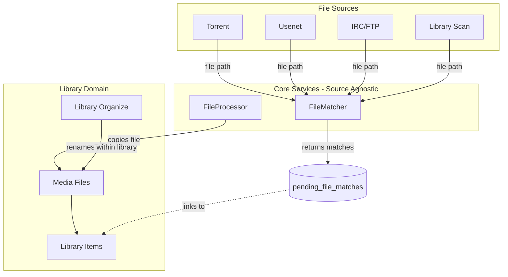
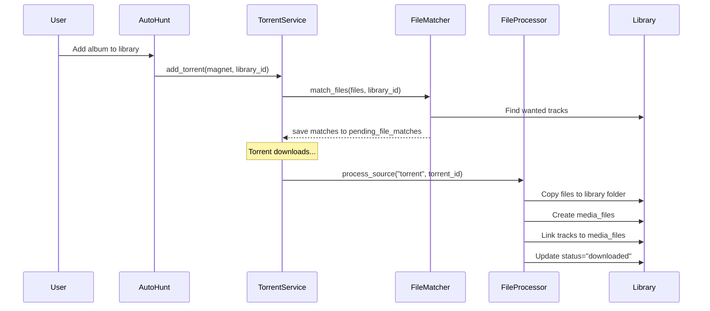
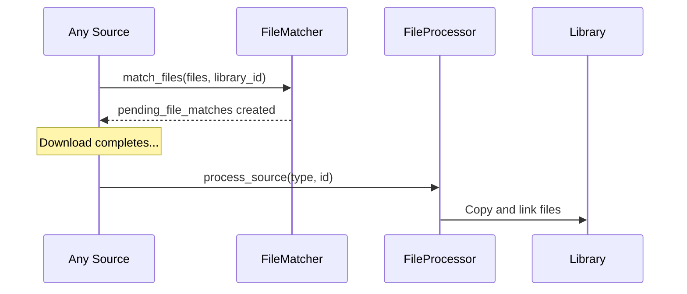

# Media Pipeline Refactor

## Architecture Overview

The matching logic is **source-agnostic** - the same code handles files from torrents, usenet, IRC, FTP, or library scans.




**Key Principles:**

1. **ONE matching function** - `FileMatcher.match_file()` is the ONLY place matching logic exists
2. **ONE copy function** - `FileProcessor.copy_and_create_media_file()` is the ONLY place file copying happens
3. **Source-agnostic** - Works identically for torrents, usenet, IRC, FTP, library scans, manual drops
4. **Library owns files** - Unlinking a download source never affects library `media_files`

## Data Model Changes

### 1. New `pending_file_matches` Table (Source-Agnostic)

Replace `torrent_file_matches` with a source-agnostic table:

```sql
CREATE TABLE pending_file_matches (
    id UUID PRIMARY KEY DEFAULT gen_random_uuid(),
    user_id UUID NOT NULL REFERENCES auth.users(id),
    
    -- Source file info (works for any source)
    source_path TEXT NOT NULL,           -- Full path to source file
    source_type VARCHAR(20) NOT NULL,    -- 'torrent', 'usenet', 'irc', 'scan', 'manual'
    source_id UUID,                      -- Optional: torrent_id, usenet_download_id, etc.
    source_file_index INTEGER,           -- For multi-file sources (torrents)
    file_size BIGINT NOT NULL,
    
    -- Match target (only one set per row)
    episode_id UUID REFERENCES episodes(id) ON DELETE CASCADE,
    movie_id UUID REFERENCES movies(id) ON DELETE CASCADE,
    track_id UUID REFERENCES tracks(id) ON DELETE CASCADE,
    chapter_id UUID REFERENCES chapters(id) ON DELETE CASCADE,
    
    -- Match metadata
    match_type VARCHAR(20) DEFAULT 'auto',  -- 'auto', 'manual'
    match_confidence DECIMAL(3,2),
    
    -- Parsed quality info (from filename)
    parsed_resolution VARCHAR(20),
    parsed_codec VARCHAR(50),
    parsed_source VARCHAR(50),
    parsed_audio VARCHAR(100),
    
    -- Processing status
    copied_at TIMESTAMPTZ,               -- null = not yet copied
    copy_error TEXT,                     -- error if copy failed
    
    created_at TIMESTAMPTZ DEFAULT NOW(),
    updated_at TIMESTAMPTZ DEFAULT NOW(),
    
    -- A file can match to multiple library items (different libraries)
    UNIQUE(source_path, episode_id),
    UNIQUE(source_path, movie_id),
    UNIQUE(source_path, track_id),
    UNIQUE(source_path, chapter_id)
);

-- Index for finding matches by source
CREATE INDEX idx_pending_file_matches_source ON pending_file_matches(source_type, source_id);
```

### 2. Library Items Link to `media_files`

Items already have `media_file_id` FK. Ensure:

- `tracks.media_file_id` → points to the library file
- `episodes` → linked via `media_files.episode_id`
- `movies` → linked via `media_files.movie_id`  
- `chapters.media_file_id` → points to the library file

### 3. Add `active_download_id` to Library Items (Source-Agnostic)

For showing progress during any download type:

```sql
-- Links to pending_file_matches - works for torrent, usenet, etc.
ALTER TABLE tracks ADD COLUMN active_download_id UUID REFERENCES pending_file_matches(id) ON DELETE SET NULL;
ALTER TABLE episodes ADD COLUMN active_download_id UUID REFERENCES pending_file_matches(id) ON DELETE SET NULL;
ALTER TABLE movies ADD COLUMN active_download_id UUID REFERENCES pending_file_matches(id) ON DELETE SET NULL;
ALTER TABLE chapters ADD COLUMN active_download_id UUID REFERENCES pending_file_matches(id) ON DELETE SET NULL;
```

### 4. Drop Old Table

```sql
DROP TABLE IF EXISTS torrent_file_matches;
```

## Service Refactor

### Phase 1: FileMatcher Service (Source-Agnostic Core)

Location: `[backend/src/services/file_matcher.rs](backend/src/services/file_matcher.rs)` (new file)

**This is THE ONLY place matching logic exists.** Used by:

- Torrent completion handler
- Usenet completion handler (future)
- IRC/FTP download handler (future)
- Library scanner for new files
- Manual file matching UI

**Responsibilities:**

- Match ANY file path to library items based on file type
- Audio files → try music libraries, then audiobook libraries
- Video files → try TV libraries, then movie libraries
- Use fuzzy matching (rapidfuzz) for title comparison
- Support matching against specific library OR all user libraries
- Can match same file to items in multiple libraries (returns all matches)

**Key Functions:**

```rust
/// Match a single file to library items
/// Returns all matching library items (can be multiple across libraries)
pub async fn match_file(
    &self,
    user_id: Uuid,
    file_path: &str,
    file_size: i64,
    target_library_id: Option<Uuid>,  // None = search all user libraries
) -> Result<Vec<FileMatch>>

/// Match multiple files at once (batch operation)
/// Used by torrent/usenet handlers that have multiple files
pub async fn match_files(
    &self,
    user_id: Uuid,
    files: Vec<FileInfo>,  // path, size pairs
    target_library_id: Option<Uuid>,
) -> Result<Vec<FileMatchResult>>

/// Save matches to pending_file_matches table
pub async fn save_matches(
    &self,
    user_id: Uuid,
    source_type: &str,       // "torrent", "usenet", "scan", etc.
    source_id: Option<Uuid>, // torrent_id, usenet_id, etc.
    matches: Vec<FileMatchResult>,
) -> Result<Vec<PendingFileMatch>>

/// Manually set a match for a file
pub async fn set_manual_match(
    &self,
    pending_match_id: Uuid,
    target: MatchTarget, // Episode(id) | Movie(id) | Track(id) | Chapter(id)
) -> Result<()>

/// Remove a match
pub async fn remove_match(&self, pending_match_id: Uuid) -> Result<()>
```

### Phase 2: FileProcessor Service (Source-Agnostic)

Location: `[backend/src/services/file_processor.rs](backend/src/services/file_processor.rs)` (new file)

**This is THE ONLY place file copying happens.** Used by:

- Torrent completion handler
- Usenet completion handler (future)
- Library scanner (for files already in library, just links them)
- Manual processing

**Responsibilities:**

- Process pending file matches (copy to library)
- Always COPY (never move) from source to library
- Create `media_file` records for copied files
- Link library items to their `media_file`
- Update item status to "downloaded"
- Clear `active_download_id` after copy
- Queue files for FFprobe analysis

**Key Functions:**

```rust
/// Process all pending matches for a source (torrent, usenet, etc.)
pub async fn process_source(
    &self,
    source_type: &str,
    source_id: Uuid,
) -> Result<ProcessResult>

/// Process a single pending match - this is THE core processing function
pub async fn process_match(
    &self,
    pending_match_id: Uuid,
) -> Result<MediaFileRecord>

/// For library scans: file already in library, just link it
pub async fn link_existing_file(
    &self,
    file_path: &str,
    match_target: &MatchTarget,
) -> Result<MediaFileRecord>
```

**Processing Flow (for each match):**

```rust
async fn process_match(&self, match_id: Uuid) -> Result<MediaFileRecord> {
    // 1. Load the pending match (has source_path and target item ID)
    let pending_match = db.pending_file_matches().get(match_id)?;
    
    // 2. Load the target item and its library
    let (target_item, library) = match pending_match.target_type() {
        Track(id) => load_track_and_library(id),
        Episode(id) => load_episode_and_library(id),
        Movie(id) => load_movie_and_library(id),
        Chapter(id) => load_chapter_and_library(id),
    };
    
    // 3. Determine destination path using library naming rules
    let naming_pattern = db.naming_patterns().get_for_library(library.id)?;
    let dest_path = apply_naming_pattern(&naming_pattern, &target_item, &library);
    
    // 4. Copy file to destination
    tokio::fs::create_dir_all(dest_path.parent())?;
    tokio::fs::copy(&pending_match.source_path, &dest_path)?;
    
    // 5. Upsert media_file record with new path
    let media_file = db.media_files().upsert(CreateMediaFile {
        library_id: library.id,
        path: dest_path,
        size_bytes: pending_match.file_size,
        // ... other fields
    })?;
    
    // 6. Link target item to media_file
    match pending_match.target_type() {
        Track(id) => db.tracks().set_media_file(id, media_file.id)?,
        Episode(id) => db.episodes().set_media_file(id, media_file.id)?,
        // ... etc
    }
    
    // 7. Update item status to "downloaded", clear active_download_id
    update_item_status(target_item, "downloaded")?;
    clear_active_download_id(target_item)?;
    
    // 8. Mark pending match as copied
    db.pending_file_matches().mark_copied(match_id)?;
    
    // 9. Queue for FFprobe analysis (runs after media_file exists)
    media_analysis_queue.enqueue(media_file.id)?;
    
    Ok(media_file)
}
```

**Key Points:**

- Processing operates on **matches** (not raw files)
- Each match knows: source path + target item + target library
- Destination path comes from library naming rules
- Always COPY (never move) from source to library
- `media_file` record created with destination path
- FFprobe runs AFTER `media_file` exists (stores results there)

### Phase 3: LibraryOrganizer Service

Location: `[backend/src/services/organizer.rs](backend/src/services/organizer.rs)` (refactor existing)

**Responsibilities:**

- Organize files already IN the library folder
- Apply naming patterns to existing `media_files`
- Triggered from library context (scan, manual)
- No knowledge of downloads or sources

**Remove:**

- All torrent-related logic
- References to download paths
- copy/move action parameter (always move within library)

**Key Functions:**

```rust
// Organize all files in a library according to naming rules
pub async fn organize_library(&self, library_id: Uuid) -> Result<OrganizeResult>

// Organize a single media file
pub async fn organize_file(&self, media_file_id: Uuid) -> Result<OrganizeResult>
```

### Phase 4: Source Integration Layer

Thin wrappers that use FileMatcher and FileProcessor:

**Torrent Integration** (in `[backend/src/jobs/torrent_completion_handler.rs](backend/src/jobs/torrent_completion_handler.rs)`):

```rust
async fn on_torrent_added(torrent_id: Uuid, library_id: Option<Uuid>) {
    let files = torrent_service.get_files(torrent_id);
    let matches = file_matcher.match_files(user_id, files, library_id);
    file_matcher.save_matches(user_id, "torrent", Some(torrent_id), matches);
    // Set active_download_id on matched items
}

async fn on_torrent_completed(torrent_id: Uuid) {
    file_processor.process_source("torrent", torrent_id);
}
```

**Library Scanner** (in `[backend/src/services/scanner.rs](backend/src/services/scanner.rs)`):

```rust
async fn scan_new_file(file_path: &str, library_id: Uuid) {
    let matches = file_matcher.match_file(user_id, file_path, size, Some(library_id));
    if !matches.is_empty() {
        // File is already in library, just link it
        file_processor.link_existing_file(file_path, &matches[0].target);
    }
}
```

### Phase 5: MediaAnalyzer Service

Ensure FFprobe runs at the right times:

1. **On file copy** - `FileProcessor` queues copied file for analysis (AFTER media_file record created)
2. **On library scan** - Scanner queues new files for analysis
3. **Analysis results** - Stored in `media_files.analysis_data` JSONB

Location: Already exists at `[backend/src/services/media_analysis.rs](backend/src/services/media_analysis.rs)`

**TODO (Future Enhancement):** FFprobe can extract ID3/metadata from audio files (album, track title, artist, etc.). This metadata could improve matching accuracy:

- Before matching: run a quick FFprobe to extract embedded tags
- Use extracted album/artist/title to score matches more accurately  
- Particularly useful for music/audiobook files where filename parsing is unreliable
- Would require a "pre-matching probe" step vs the current "post-copy probe"

## Automatic Flow




**Same flow works for any source:**




## GraphQL API Changes

### Shared Types (Source-Agnostic)

```graphql
enum MatchTargetType {
  EPISODE
  MOVIE
  TRACK
  CHAPTER
}

type PendingFileMatch {
  id: ID!
  sourcePath: String!
  sourceType: String!             # "torrent", "usenet", "scan", etc.
  sourceId: ID                    # torrent_id, usenet_id, etc.
  targetType: MatchTargetType!
  targetId: ID!
  targetName: String!             # e.g., "Don't Cry" or "S01E05"
  libraryName: String!
  confidence: Float!
  copiedAt: DateTime              # null = not yet copied
  copyError: String
}
```

### Torrent Queries

```graphql
type Torrent {
  # Existing fields...
  linkedLibrary: Library          # Primary library for this torrent
  pendingMatches: [PendingFileMatch!]!  # All pending matches for this torrent
}

type TorrentFileInfo {
  index: Int!
  path: String!
  size: Int!
  progress: Float!
  matches: [PendingFileMatch!]!   # Matches for this specific file
}
```

### Match Mutations (Source-Agnostic)

```graphql
# Re-match all files from a source
mutation RematchSource($sourceType: String!, $sourceId: ID!, $libraryId: ID) {
  rematchSource(sourceType: $sourceType, sourceId: $sourceId, libraryId: $libraryId) {
    success
    matchCount
    error
  }
}

# Manually set a match target
mutation SetMatch($matchId: ID!, $targetType: MatchTargetType!, $targetId: ID!) {
  setMatch(matchId: $matchId, targetType: $targetType, targetId: $targetId) {
    success
    error
  }
}

# Remove a specific match
mutation RemoveMatch($matchId: ID!) {
  removeMatch(matchId: $matchId) {
    success
    error
  }
}

# Manually trigger processing for a source
mutation ProcessSource($sourceType: String!, $sourceId: ID!) {
  processSource(sourceType: $sourceType, sourceId: $sourceId) {
    success
    filesCopied: Int!
    error
  }
}
```

### Library Mutations

```graphql
# Organize files in a library (renames within library folder)
mutation OrganizeLibrary($libraryId: ID!) {
  organizeLibrary(libraryId: $libraryId) {
    success
    filesOrganized: Int!
    error
  }
}
```

## Frontend Changes

### Downloads Table

Add columns:

- **Library** - Shows linked library name (or "Unlinked")
- Update **Actions** dropdown:
  - "Rematch" - Re-run matching against libraries
  - "Link to Library" - Set target library for matching
  - "Unlink" - Remove library association
  - "Process" - Manual trigger copy (normally automatic)
  - Remove "Organize" (moved to library context)

### Torrent Detail Modal

Update files table:

- **Match** column shows list of matches (can be multiple across libraries)
- Each match shows: type icon, target name, library name, copied status chip
- **Actions** per match:
  - "Fix Match" - Opens picker to select different target item
  - "Remove Match" - Removes this specific match

### Library Items (Tracks/Episodes/Movies/Chapters)

Status display logic:

- `wanted` / `missing` → Show "Wanted" chip
- `downloading` + `active_download_id` set → Show progress bar (works for torrent/usenet/etc)
- `downloaded` + `media_file_id` set → Show file info (size, quality, duration)

Progress bar source:

- Look up `pending_file_matches` by `active_download_id`
- Get `source_type` and `source_id` from the match
- If `source_type == "torrent"`, get progress from torrent subscription
- If `source_type == "usenet"`, get progress from usenet subscription (future)

## Migration Strategy

### Database Migration

```sql
-- 1. Create new pending_file_matches table (source-agnostic)
CREATE TABLE pending_file_matches (
    id UUID PRIMARY KEY DEFAULT gen_random_uuid(),
    user_id UUID NOT NULL REFERENCES auth.users(id),
    source_path TEXT NOT NULL,
    source_type VARCHAR(20) NOT NULL,
    source_id UUID,
    source_file_index INTEGER,
    file_size BIGINT NOT NULL,
    episode_id UUID REFERENCES episodes(id) ON DELETE CASCADE,
    movie_id UUID REFERENCES movies(id) ON DELETE CASCADE,
    track_id UUID REFERENCES tracks(id) ON DELETE CASCADE,
    chapter_id UUID REFERENCES chapters(id) ON DELETE CASCADE,
    match_type VARCHAR(20) DEFAULT 'auto',
    match_confidence DECIMAL(3,2),
    parsed_resolution VARCHAR(20),
    parsed_codec VARCHAR(50),
    parsed_source VARCHAR(50),
    parsed_audio VARCHAR(100),
    copied_at TIMESTAMPTZ,
    copy_error TEXT,
    created_at TIMESTAMPTZ DEFAULT NOW(),
    updated_at TIMESTAMPTZ DEFAULT NOW()
);

CREATE INDEX idx_pending_file_matches_source ON pending_file_matches(source_type, source_id);
CREATE INDEX idx_pending_file_matches_user ON pending_file_matches(user_id);

-- 2. Add active_download_id to library items (source-agnostic)
ALTER TABLE tracks ADD COLUMN active_download_id UUID REFERENCES pending_file_matches(id) ON DELETE SET NULL;
ALTER TABLE episodes ADD COLUMN active_download_id UUID REFERENCES pending_file_matches(id) ON DELETE SET NULL;
ALTER TABLE movies ADD COLUMN active_download_id UUID REFERENCES pending_file_matches(id) ON DELETE SET NULL;
ALTER TABLE chapters ADD COLUMN active_download_id UUID REFERENCES pending_file_matches(id) ON DELETE SET NULL;

-- 3. Drop old torrent_file_matches table
DROP TABLE IF EXISTS torrent_file_matches;

-- 4. Clean up existing data (fresh start per user request)
TRUNCATE torrents, media_files CASCADE;
```

### File Cleanup

User confirmed:

- Delete all files in `/data/media/` 
- Clear all torrent data

## Key Files to Modify


| File                                                                                                               | Changes                                                |
| ------------------------------------------------------------------------------------------------------------------ | ------------------------------------------------------ |
| `[backend/src/services/file_matcher.rs](backend/src/services/file_matcher.rs)`                                     | NEW: Source-agnostic matching service                  |
| `[backend/src/services/file_processor.rs](backend/src/services/file_processor.rs)`                                 | NEW: Source-agnostic file copy service                 |
| `[backend/src/services/torrent_file_matcher.rs](backend/src/services/torrent_file_matcher.rs)`                     | DELETE: Replaced by file_matcher.rs                    |
| `[backend/src/services/media_processor.rs](backend/src/services/media_processor.rs)`                               | DELETE: Replaced by file_processor.rs                  |
| `[backend/src/services/organizer.rs](backend/src/services/organizer.rs)`                                           | Refactor: library-only operations, no source knowledge |
| `[backend/src/services/scanner.rs](backend/src/services/scanner.rs)`                                               | Update: Use FileMatcher for new files                  |
| `[backend/src/db/pending_file_matches.rs](backend/src/db/pending_file_matches.rs)`                                 | NEW: Repository for pending_file_matches table         |
| `[backend/src/graphql/mutations/](backend/src/graphql/mutations/)`                                                 | Update: New match/process mutations                    |
| `[backend/src/jobs/torrent_completion_handler.rs](backend/src/jobs/torrent_completion_handler.rs)`                 | Update: Call FileMatcher + FileProcessor               |
| `[frontend/src/routes/downloads/index.tsx](frontend/src/routes/downloads/index.tsx)`                               | Add Library column, update actions                     |
| `[frontend/src/components/downloads/TorrentInfoModal.tsx](frontend/src/components/downloads/TorrentInfoModal.tsx)` | Per-file match controls                                |
| `[frontend/src/lib/graphql/](frontend/src/lib/graphql/)`                                                           | Update queries/mutations                               |


## Implementation Order

1. **Database migration** - Create pending_file_matches, add active_download_id, drop old table
2. **FileMatcher service** - Source-agnostic matching (refactor from torrent_file_matcher)
3. **FileProcessor service** - Source-agnostic file copy (new service, always copy)
4. **Organizer refactor** - Remove all source/torrent references
5. **DB Repository** - pending_file_matches CRUD operations
6. **GraphQL API** - New mutations (rematchSource, setMatch, removeMatch, processSource)
7. **Torrent integration** - Wire FileMatcher + FileProcessor on add/complete
8. **Scanner integration** - Use FileMatcher for new files during library scan
9. **Frontend downloads** - Table and modal updates
10. **Frontend library items** - Progress bar display using active_download_id
