# Backend Flows

This document describes the key backend flows in Librarian using Mermaid diagrams.

## Table of Contents

- [Library Scanning](#library-scanning)
- [Adding a New Library](#adding-a-new-library)
- [Torrent Lifecycle](#torrent-lifecycle)
- [File Organization](#file-organization)
- [Auto-Hunt System](#auto-hunt-system)
- [Content Acquisition Workflows](#content-acquisition-workflows)

---

## Library Scanning

When a library scan is triggered (manually, on schedule, or after library creation), the following flow occurs:

### High-Level Scan Flow

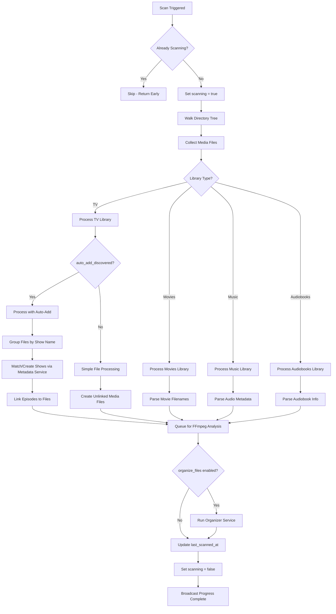
```mermaid
flowchart TD
    A[Scan Triggered] --> B{Already Scanning?}
    B -->|Yes| C[Skip - Return Early]
    B -->|No| D[Set scanning = true]
    D --> E[Walk Directory Tree]
    E --> F[Collect Media Files]
    F --> G{Library Type?}
    
    G -->|TV| H[Process TV Library]
    G -->|Movies| I[Process Movies Library]
    G -->|Music| J[Process Music Library]
    G -->|Audiobooks| K[Process Audiobooks Library]
    
    H --> L{auto_add_discovered?}
    L -->|Yes| M[Process with Auto-Add]
    L -->|No| N[Simple File Processing]
    
    M --> O[Group Files by Show Name]
    O --> P[Match/Create Shows via Metadata Service]
    P --> Q[Link Episodes to Files]
    
    N --> R[Create Unlinked Media Files]
    
    I --> S[Parse Movie Filenames]
    J --> T[Parse Audio Metadata]
    K --> U[Parse Audiobook Info]
    
    Q --> V[Queue for FFmpeg Analysis]
    R --> V
    S --> V
    T --> V
    U --> V
    
    V --> W{organize_files enabled?}
    W -->|Yes| X[Run Organizer Service]
    W -->|No| Y[Update last_scanned_at]
    
    X --> Y
    Y --> Z[Set scanning = false]
    Z --> AA[Broadcast Progress Complete]
```

### TV Library Scan Detail (with Auto-Add)

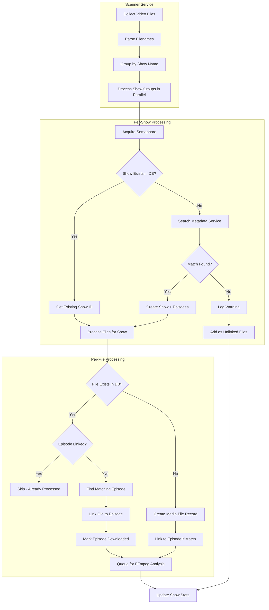
```mermaid
flowchart TD
    subgraph Scanner["Scanner Service"]
        A[Collect Video Files] --> B[Parse Filenames]
        B --> C[Group by Show Name]
        C --> D[Process Show Groups in Parallel]
    end
    
    subgraph ShowProcessing["Per-Show Processing"]
        D --> E[Acquire Semaphore]
        E --> F{Show Exists in DB?}
        F -->|Yes| G[Get Existing Show ID]
        F -->|No| H[Search Metadata Service]
        H --> I{Match Found?}
        I -->|Yes| J[Create Show + Episodes]
        I -->|No| K[Log Warning]
        
        G --> L[Process Files for Show]
        J --> L
        K --> M[Add as Unlinked Files]
    end
    
    subgraph FileProcessing["Per-File Processing"]
        L --> N{File Exists in DB?}
        N -->|Yes| O{Episode Linked?}
        N -->|No| P[Create Media File Record]
        
        O -->|Yes| Q[Skip - Already Processed]
        O -->|No| R[Find Matching Episode]
        R --> S[Link File to Episode]
        S --> T[Mark Episode Downloaded]
        
        P --> U[Link to Episode if Match]
        U --> V[Queue for FFmpeg Analysis]
        T --> V
    end
    
    V --> W[Update Show Stats]
    M --> W
```

### Metadata Lookup Flow

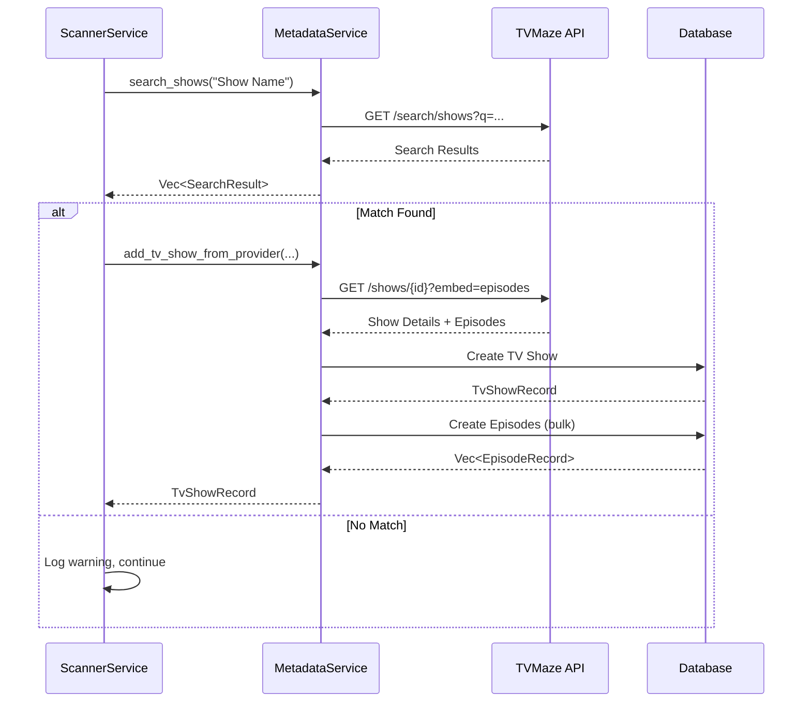
```mermaid
sequenceDiagram
    participant Scanner as ScannerService
    participant Meta as MetadataService
    participant TVMaze as TVMaze API
    participant DB as Database
    
    Scanner->>Meta: search_shows("Show Name")
    Meta->>TVMaze: GET /search/shows?q=...
    TVMaze-->>Meta: Search Results
    Meta-->>Scanner: Vec<SearchResult>
    
    alt Match Found
        Scanner->>Meta: add_tv_show_from_provider(...)
        Meta->>TVMaze: GET /shows/{id}?embed=episodes
        TVMaze-->>Meta: Show Details + Episodes
        Meta->>DB: Create TV Show
        DB-->>Meta: TvShowRecord
        Meta->>DB: Create Episodes (bulk)
        DB-->>Meta: Vec<EpisodeRecord>
        Meta-->>Scanner: TvShowRecord
    else No Match
        Scanner->>Scanner: Log warning, continue
    end
```

---

## Adding a New Library

When a user creates a new library via GraphQL mutation:

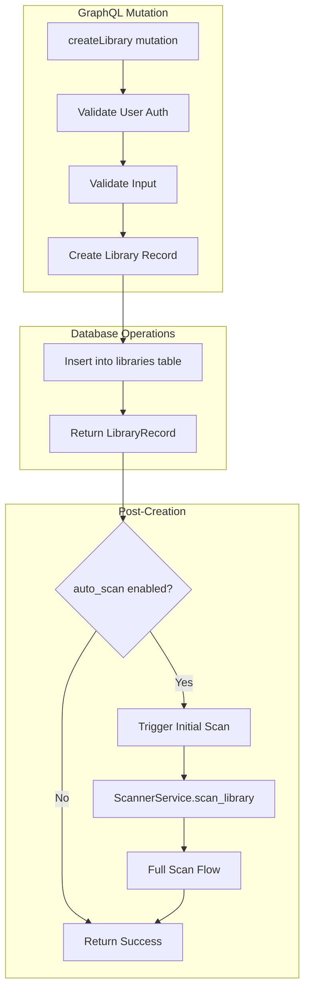
```mermaid
flowchart TD
    subgraph GraphQL["GraphQL Mutation"]
        A[createLibrary mutation] --> B[Validate User Auth]
        B --> C[Validate Input]
        C --> D[Create Library Record]
    end
    
    subgraph Database["Database Operations"]
        D --> E[Insert into libraries table]
        E --> F[Return LibraryRecord]
    end
    
    subgraph PostCreation["Post-Creation"]
        F --> G{auto_scan enabled?}
        G -->|Yes| H[Trigger Initial Scan]
        G -->|No| I[Return Success]
        
        H --> J[ScannerService.scan_library]
        J --> K[Full Scan Flow]
        K --> I
    end
```

### Library Settings Applied

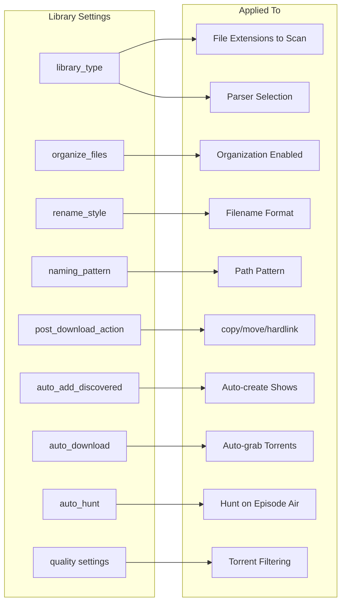
```mermaid
flowchart LR
    subgraph LibrarySettings["Library Settings"]
        A[library_type]
        B[organize_files]
        C[rename_style]
        D[naming_pattern]
        E[post_download_action]
        F[auto_add_discovered]
        G[auto_download]
        H[auto_hunt]
        I[quality settings]
    end
    
    subgraph Effects["Applied To"]
        A --> J[File Extensions to Scan]
        A --> K[Parser Selection]
        
        B --> L[Organization Enabled]
        C --> M[Filename Format]
        D --> N[Path Pattern]
        
        E --> O[copy/move/hardlink]
        
        F --> P[Auto-create Shows]
        G --> Q[Auto-grab Torrents]
        H --> R[Hunt on Episode Air]
        
        I --> S[Torrent Filtering]
    end
```

---

## Torrent Lifecycle

### Adding a Torrent

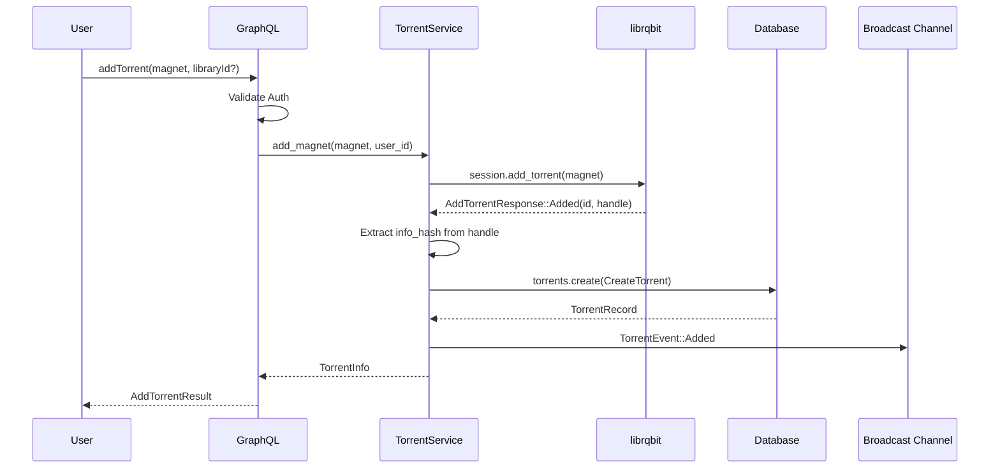
```mermaid
sequenceDiagram
    participant User
    participant GQL as GraphQL
    participant TS as TorrentService
    participant LRQ as librqbit
    participant DB as Database
    participant Events as Broadcast Channel
    
    User->>GQL: addTorrent(magnet, libraryId?)
    GQL->>GQL: Validate Auth
    GQL->>TS: add_magnet(magnet, user_id)
    
    TS->>LRQ: session.add_torrent(magnet)
    LRQ-->>TS: AddTorrentResponse::Added(id, handle)
    
    TS->>TS: Extract info_hash from handle
    TS->>DB: torrents.create(CreateTorrent)
    DB-->>TS: TorrentRecord
    
    TS->>Events: TorrentEvent::Added
    TS-->>GQL: TorrentInfo
    GQL-->>User: AddTorrentResult
```

### Torrent Download Progress

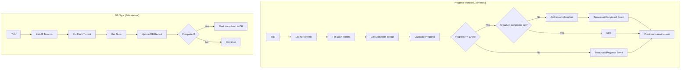
```mermaid
flowchart TD
    subgraph ProgressMonitor["Progress Monitor (1s interval)"]
        A[Tick] --> B[List All Torrents]
        B --> C[For Each Torrent]
        C --> D[Get Stats from librqbit]
        D --> E[Calculate Progress]
        E --> F{Progress >= 100%?}
        
        F -->|Yes| G{Already in completed set?}
        G -->|No| H[Add to completed set]
        H --> I[Broadcast Completed Event]
        G -->|Yes| J[Skip]
        
        F -->|No| K[Broadcast Progress Event]
        
        I --> L[Continue to next torrent]
        J --> L
        K --> L
    end
    
    subgraph DBSync["DB Sync (10s interval)"]
        M[Tick] --> N[List All Torrents]
        N --> O[For Each Torrent]
        O --> P[Get Stats]
        P --> Q[Update DB Record]
        Q --> R{Completed?}
        R -->|Yes| S[Mark completed in DB]
        R -->|No| T[Continue]
    end
```

### Torrent Completion & Processing

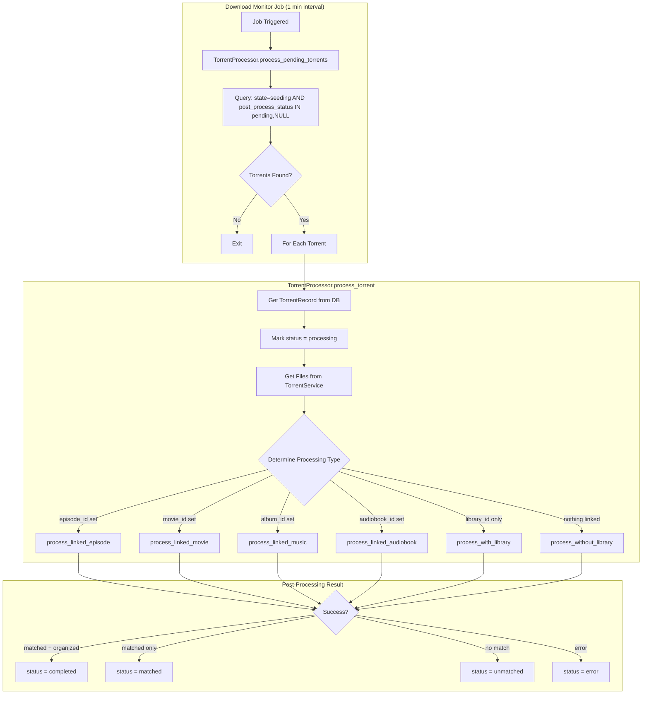
```mermaid
flowchart TD
    subgraph DownloadMonitor["Download Monitor Job (1 min interval)"]
        A[Job Triggered] --> B[TorrentProcessor.process_pending_torrents]
        B --> C[Query: state=seeding AND post_process_status IN pending,NULL]
        C --> D{Torrents Found?}
        D -->|No| E[Exit]
        D -->|Yes| F[For Each Torrent]
    end
    
    subgraph Processing["TorrentProcessor.process_torrent"]
        F --> G[Get TorrentRecord from DB]
        G --> H[Mark status = processing]
        H --> I[Get Files from TorrentService]
        I --> J{Determine Processing Type}
        
        J -->|episode_id set| K[process_linked_episode]
        J -->|movie_id set| L[process_linked_movie]
        J -->|album_id set| M[process_linked_music]
        J -->|audiobook_id set| N[process_linked_audiobook]
        J -->|library_id only| O[process_with_library]
        J -->|nothing linked| P[process_without_library]
    end
    
    subgraph Result["Post-Processing Result"]
        K --> Q{Success?}
        L --> Q
        M --> Q
        N --> Q
        O --> Q
        P --> Q
        
        Q -->|matched + organized| R[status = completed]
        Q -->|matched only| S[status = matched]
        Q -->|no match| T[status = unmatched]
        Q -->|error| U[status = error]
    end
```

### Processing Linked Episode

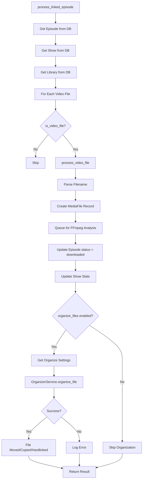
```mermaid
flowchart TD
    A[process_linked_episode] --> B[Get Episode from DB]
    B --> C[Get Show from DB]
    C --> D[Get Library from DB]
    D --> E[For Each Video File]
    
    E --> F{is_video_file?}
    F -->|No| G[Skip]
    F -->|Yes| H[process_video_file]
    
    H --> I[Parse Filename]
    I --> J[Create MediaFile Record]
    J --> K[Queue for FFmpeg Analysis]
    K --> L[Update Episode status = downloaded]
    L --> M[Update Show Stats]
    
    M --> N{organize_files enabled?}
    N -->|Yes| O[Get Organize Settings]
    O --> P[OrganizerService.organize_file]
    P --> Q{Success?}
    Q -->|Yes| R[File Moved/Copied/Hardlinked]
    Q -->|No| S[Log Error]
    
    N -->|No| T[Skip Organization]
    
    R --> U[Return Result]
    S --> U
    T --> U
```

### Auto-Matching and Auto-Adding Torrents

When a torrent is linked to a library (but not a specific item), the system can auto-add entries:

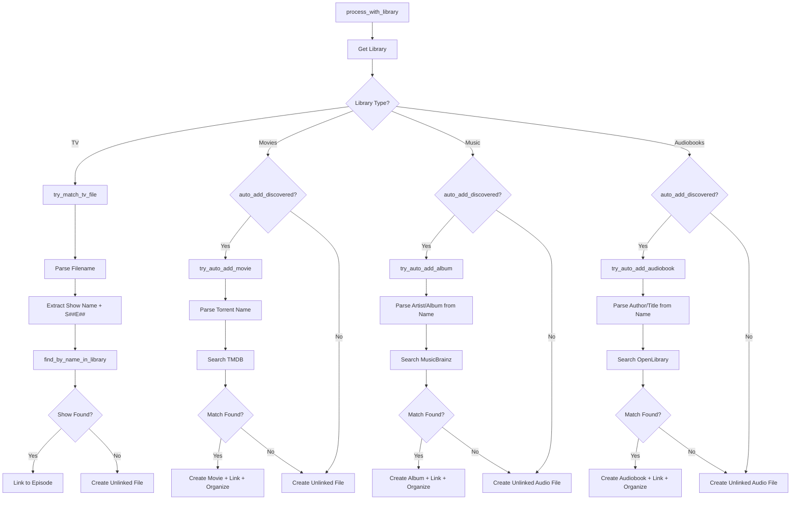
```mermaid
flowchart TD
    A[process_with_library] --> B[Get Library]
    B --> C{Library Type?}
    
    C -->|TV| D[try_match_tv_file]
    C -->|Movies| E{auto_add_discovered?}
    C -->|Music| F{auto_add_discovered?}
    C -->|Audiobooks| G{auto_add_discovered?}
    
    D --> H[Parse Filename]
    H --> I[Extract Show Name + S##E##]
    I --> J[find_by_name_in_library]
    J --> K{Show Found?}
    K -->|Yes| L[Link to Episode]
    K -->|No| M[Create Unlinked File]
    
    E -->|Yes| N[try_auto_add_movie]
    E -->|No| O[Create Unlinked File]
    N --> P[Parse Torrent Name]
    P --> Q[Search TMDB]
    Q --> R{Match Found?}
    R -->|Yes| S[Create Movie + Link + Organize]
    R -->|No| O
    
    F -->|Yes| T[try_auto_add_album]
    F -->|No| U[Create Unlinked Audio File]
    T --> V[Parse Artist/Album from Name]
    V --> W[Search MusicBrainz]
    W --> X{Match Found?}
    X -->|Yes| Y[Create Album + Link + Organize]
    X -->|No| U
    
    G -->|Yes| Z[try_auto_add_audiobook]
    G -->|No| AA[Create Unlinked Audio File]
    Z --> AB[Parse Author/Title from Name]
    AB --> AC[Search OpenLibrary]
    AC --> AD{Match Found?}
    AD -->|Yes| AE[Create Audiobook + Link + Organize]
    AD -->|No| AA
```

### Force Reprocessing (Organize Action)

When triggering manual organization from the Downloads page with force=true:

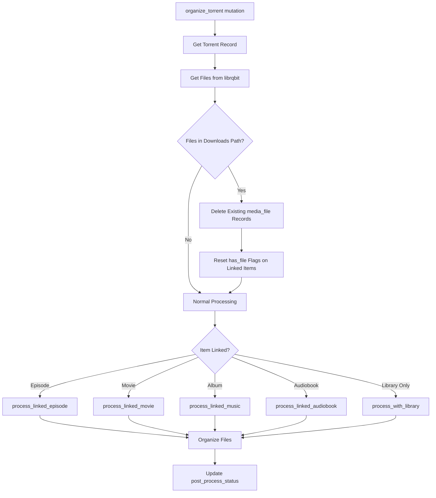
```mermaid
flowchart TD
    A[organize_torrent mutation] --> B[Get Torrent Record]
    B --> C[Get Files from librqbit]
    C --> D{Files in Downloads Path?}
    
    D -->|Yes| E[Delete Existing media_file Records]
    E --> F[Reset has_file Flags on Linked Items]
    
    D -->|No| G[Normal Processing]
    F --> G
    
    G --> H{Item Linked?}
    H -->|Episode| I[process_linked_episode]
    H -->|Movie| J[process_linked_movie]
    H -->|Album| K[process_linked_music]
    H -->|Audiobook| L[process_linked_audiobook]
    H -->|Library Only| M[process_with_library]
    
    I --> N[Organize Files]
    J --> N
    K --> N
    L --> N
    M --> N
    
    N --> O[Update post_process_status]
```

---

## File Organization

### Organization Decision Flow

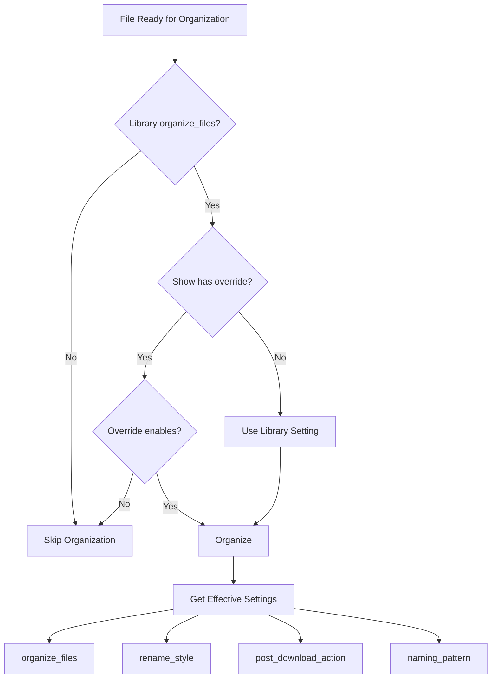
```mermaid
flowchart TD
    A[File Ready for Organization] --> B{Library organize_files?}
    B -->|No| C[Skip Organization]
    B -->|Yes| D{Show has override?}
    
    D -->|Yes| E{Override enables?}
    D -->|No| F[Use Library Setting]
    
    E -->|Yes| G[Organize]
    E -->|No| C
    F --> G
    
    G --> H[Get Effective Settings]
    H --> I[organize_files]
    H --> J[rename_style]
    H --> K[post_download_action]
    H --> L[naming_pattern]
```

### Organize File Operation

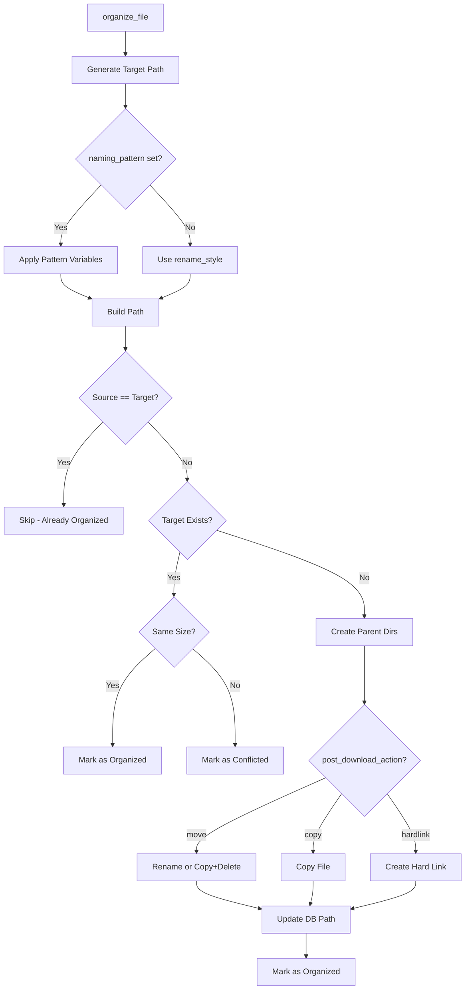
```mermaid
flowchart TD
    A[organize_file] --> B[Generate Target Path]
    B --> C{naming_pattern set?}
    
    C -->|Yes| D[Apply Pattern Variables]
    C -->|No| E[Use rename_style]
    
    D --> F[Build Path]
    E --> F
    
    F --> G{Source == Target?}
    G -->|Yes| H[Skip - Already Organized]
    G -->|No| I{Target Exists?}
    
    I -->|Yes| J{Same Size?}
    J -->|Yes| K[Mark as Organized]
    J -->|No| L[Mark as Conflicted]
    
    I -->|No| M[Create Parent Dirs]
    M --> N{post_download_action?}
    
    N -->|move| O[Rename or Copy+Delete]
    N -->|copy| P[Copy File]
    N -->|hardlink| Q[Create Hard Link]
    
    O --> R[Update DB Path]
    P --> R
    Q --> R
    
    R --> S[Mark as Organized]
```

### Naming Pattern Variables

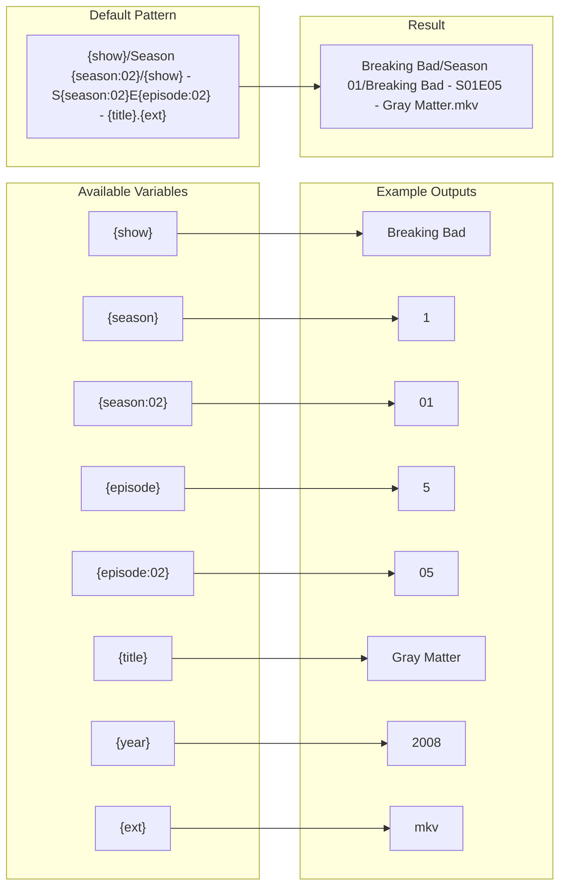
```mermaid
flowchart LR
    subgraph Variables["Available Variables"]
        A["{show}"]
        B["{season}"]
        C["{season:02}"]
        D["{episode}"]
        E["{episode:02}"]
        F["{title}"]
        G["{year}"]
        H["{ext}"]
    end
    
    subgraph Examples["Example Outputs"]
        A --> I["Breaking Bad"]
        B --> J["1"]
        C --> K["01"]
        D --> L["5"]
        E --> M["05"]
        F --> N["Gray Matter"]
        G --> O["2008"]
        H --> P["mkv"]
    end
    
    subgraph Pattern["Default Pattern"]
        Q["{show}/Season {season:02}/{show} - S{season:02}E{episode:02} - {title}.{ext}"]
    end
    
    subgraph Result["Result"]
        R["Breaking Bad/Season 01/Breaking Bad - S01E05 - Gray Matter.mkv"]
    end
    
    Q --> R
```

---

## Scheduled Jobs

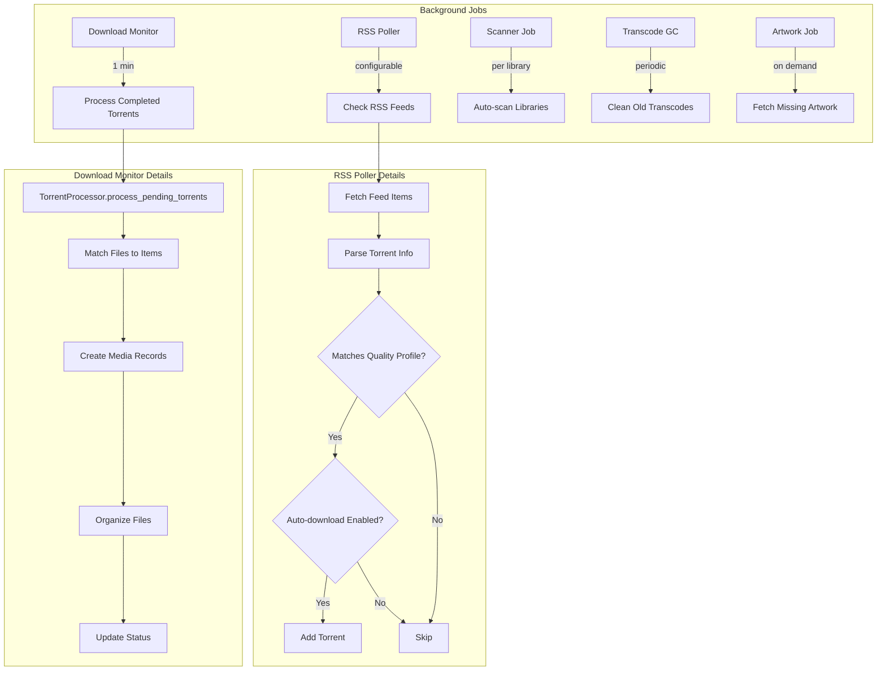
```mermaid
flowchart TD
    subgraph Jobs["Background Jobs"]
        A[Download Monitor] -->|1 min| B[Process Completed Torrents]
        C[RSS Poller] -->|configurable| D[Check RSS Feeds]
        E[Scanner Job] -->|per library| F[Auto-scan Libraries]
        G[Transcode GC] -->|periodic| H[Clean Old Transcodes]
        I[Artwork Job] -->|on demand| J[Fetch Missing Artwork]
    end
    
    subgraph DownloadMonitor["Download Monitor Details"]
        B --> K[TorrentProcessor.process_pending_torrents]
        K --> L[Match Files to Items]
        L --> M[Create Media Records]
        M --> N[Organize Files]
        N --> O[Update Status]
    end
    
    subgraph RSSPoller["RSS Poller Details"]
        D --> P[Fetch Feed Items]
        P --> Q[Parse Torrent Info]
        Q --> R{Matches Quality Profile?}
        R -->|Yes| S{Auto-download Enabled?}
        S -->|Yes| T[Add Torrent]
        R -->|No| U[Skip]
        S -->|No| U
    end
```

---

## Auto-Hunt System

Auto-hunt is **event-driven**, not scheduled. It triggers:
1. **Immediately when adding content** - Adding a movie/album/audiobook triggers hunt for that item
2. **After library scans** - Each scan triggers auto-hunt for all missing content in that library

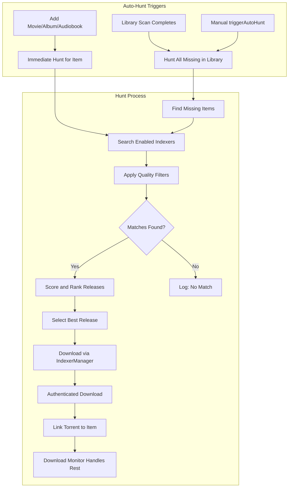
```mermaid
flowchart TD
    subgraph Triggers["Auto-Hunt Triggers"]
        A[Add Movie/Album/Audiobook] --> B[Immediate Hunt for Item]
        C[Library Scan Completes] --> D[Hunt All Missing in Library]
        E[Manual triggerAutoHunt] --> D
    end
    
    subgraph HuntProcess["Hunt Process"]
        B --> F[Search Enabled Indexers]
        D --> G[Find Missing Items]
        G --> F
        
        F --> H[Apply Quality Filters]
        H --> I{Matches Found?}
        
        I -->|Yes| J[Score and Rank Releases]
        I -->|No| K[Log: No Match]
        
        J --> L[Select Best Release]
        L --> M[Download via IndexerManager]
        M --> N[Authenticated Download]
        N --> O[Link Torrent to Item]
        O --> P[Download Monitor Handles Rest]
    end
```

### Authenticated Downloads

Private tracker downloads go through the IndexerManager for proper authentication:

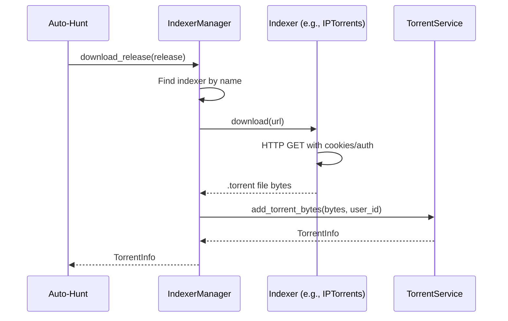
```mermaid
sequenceDiagram
    participant Hunt as Auto-Hunt
    participant IM as IndexerManager
    participant Idx as Indexer (e.g., IPTorrents)
    participant TS as TorrentService
    
    Hunt->>IM: download_release(release)
    IM->>IM: Find indexer by name
    IM->>Idx: download(url)
    Idx->>Idx: HTTP GET with cookies/auth
    Idx-->>IM: .torrent file bytes
    IM->>TS: add_torrent_bytes(bytes, user_id)
    TS-->>IM: TorrentInfo
    IM-->>Hunt: TorrentInfo
```

---

## Event Flow (Subscriptions)

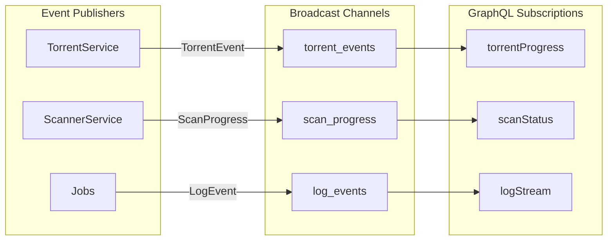
```mermaid
flowchart LR
    subgraph Publishers["Event Publishers"]
        A[TorrentService]
        B[ScannerService]
        C[Jobs]
    end
    
    subgraph Channels["Broadcast Channels"]
        D[torrent_events]
        E[scan_progress]
        F[log_events]
    end
    
    subgraph Subscribers["GraphQL Subscriptions"]
        G[torrentProgress]
        H[scanStatus]
        I[logStream]
    end
    
    A -->|TorrentEvent| D
    B -->|ScanProgress| E
    C -->|LogEvent| F
    
    D --> G
    E --> H
    F --> I
```

---

## Content Acquisition Workflows

Librarian supports two complementary workflows for acquiring content:

### Library-First Workflow

Start from the library, add what you want, system finds and downloads it automatically.

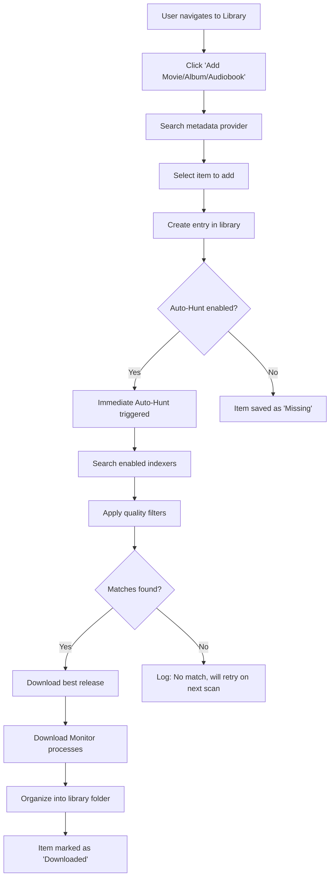
```mermaid
flowchart TD
    A[User navigates to Library] --> B[Click 'Add Movie/Album/Audiobook']
    B --> C[Search metadata provider]
    C --> D[Select item to add]
    D --> E[Create entry in library]
    E --> F{Auto-Hunt enabled?}
    
    F -->|Yes| G[Immediate Auto-Hunt triggered]
    F -->|No| H[Item saved as 'Missing']
    
    G --> I[Search enabled indexers]
    I --> J[Apply quality filters]
    J --> K{Matches found?}
    
    K -->|Yes| L[Download best release]
    K -->|No| M[Log: No match, will retry on next scan]
    
    L --> N[Download Monitor processes]
    N --> O[Organize into library folder]
    O --> P[Item marked as 'Downloaded']
```

### Torrent-First Workflow

Find a torrent first, then add it to your library. Requires `auto_add_discovered` enabled.

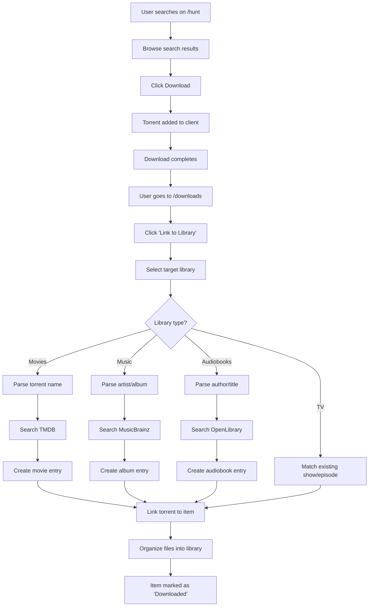
```mermaid
flowchart TD
    A[User searches on /hunt] --> B[Browse search results]
    B --> C[Click Download]
    C --> D[Torrent added to client]
    D --> E[Download completes]
    
    E --> F[User goes to /downloads]
    F --> G[Click 'Link to Library']
    G --> H[Select target library]
    
    H --> I{Library type?}
    
    I -->|Movies| J[Parse torrent name]
    J --> K[Search TMDB]
    K --> L[Create movie entry]
    
    I -->|Music| M[Parse artist/album]
    M --> N[Search MusicBrainz]
    N --> O[Create album entry]
    
    I -->|Audiobooks| P[Parse author/title]
    P --> Q[Search OpenLibrary]
    Q --> R[Create audiobook entry]
    
    I -->|TV| S[Match existing show/episode]
    
    L --> T[Link torrent to item]
    O --> T
    R --> T
    S --> T
    
    T --> U[Organize files into library]
    U --> V[Item marked as 'Downloaded']
```

### Key Difference

| Aspect | Library-First | Torrent-First |
|--------|---------------|---------------|
| Starting point | Library UI | Hunt/Downloads page |
| Entry creation | Before download | After download |
| Auto-Hunt | Required | Not used |
| auto_add_discovered | Optional | Required |
| Use case | "I want this movie" | "Found a good release, add it" |
