# Backend Flows

This document describes the key backend flows in Librarian using Mermaid diagrams.

## Table of Contents

- [Library Scanning](#library-scanning)
- [Adding a New Library](#adding-a-new-library)
- [Torrent Lifecycle](#torrent-lifecycle)
- [File Organization](#file-organization)

---

## Library Scanning

When a library scan is triggered (manually, on schedule, or after library creation), the following flow occurs:

### High-Level Scan Flow

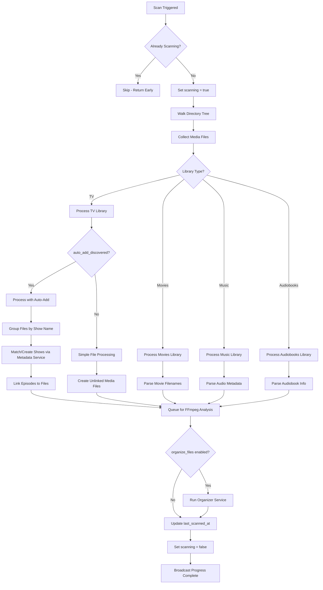

### TV Library Scan Detail (with Auto-Add)

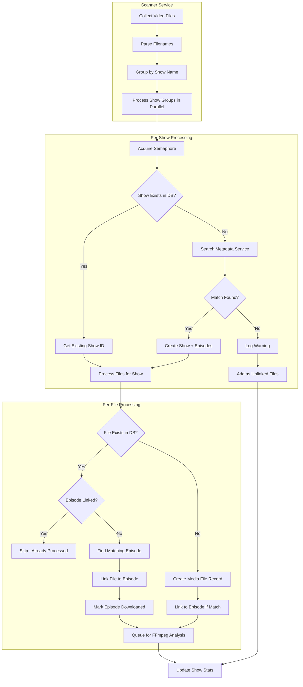

### Metadata Lookup Flow

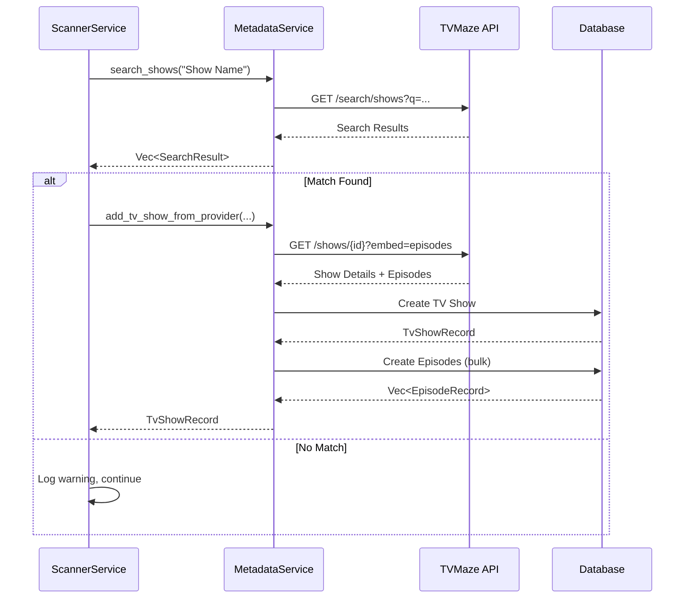

---

## Adding a New Library

When a user creates a new library via GraphQL mutation:

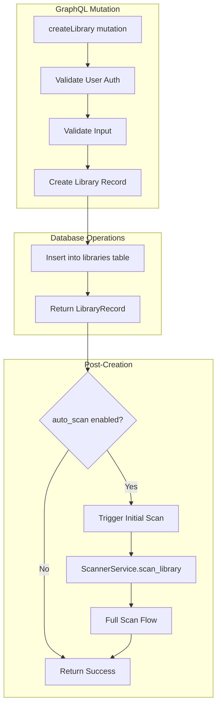

### Library Settings Applied

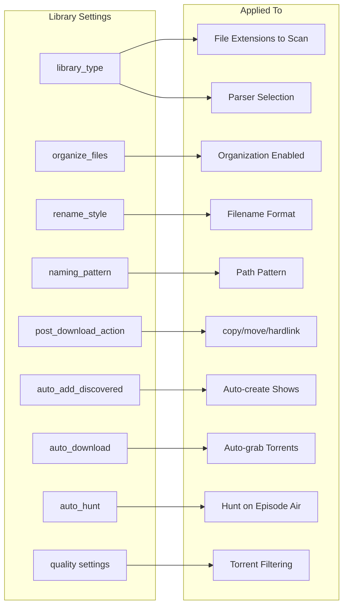

---

## Torrent Lifecycle

### Adding a Torrent

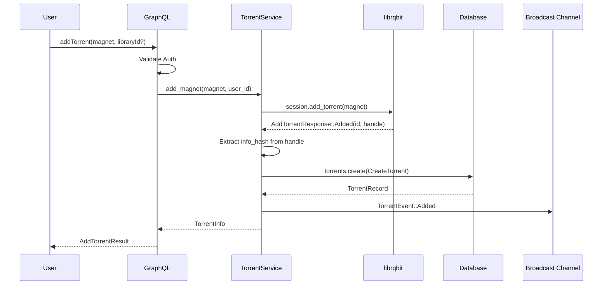

### Torrent Download Progress

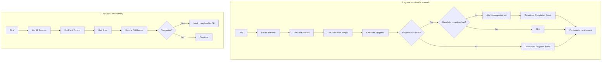

### Torrent Completion & Processing

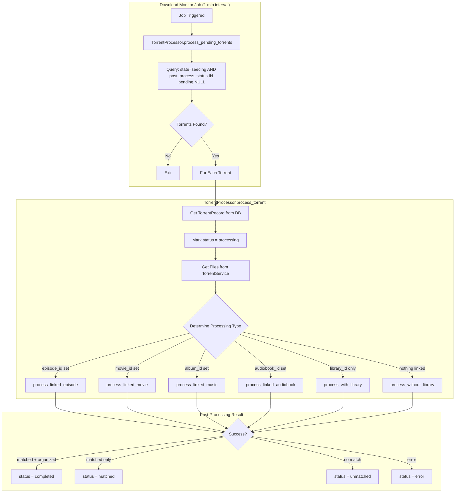

### Processing Linked Episode

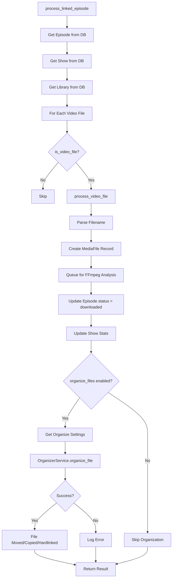

### Auto-Matching Unlinked Torrents

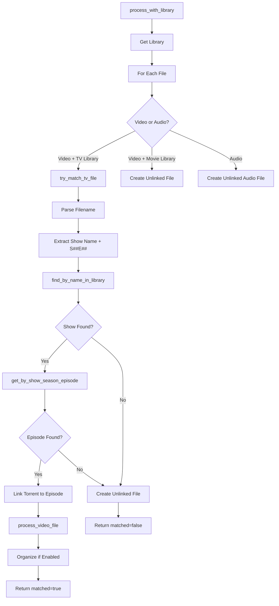

---

## File Organization

### Organization Decision Flow

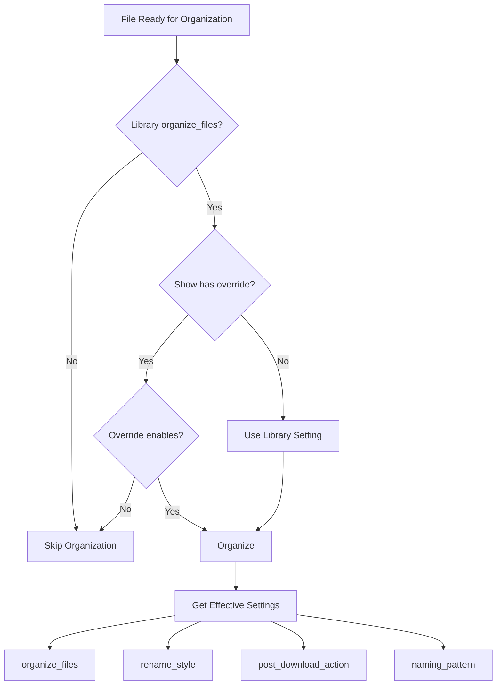

### Organize File Operation

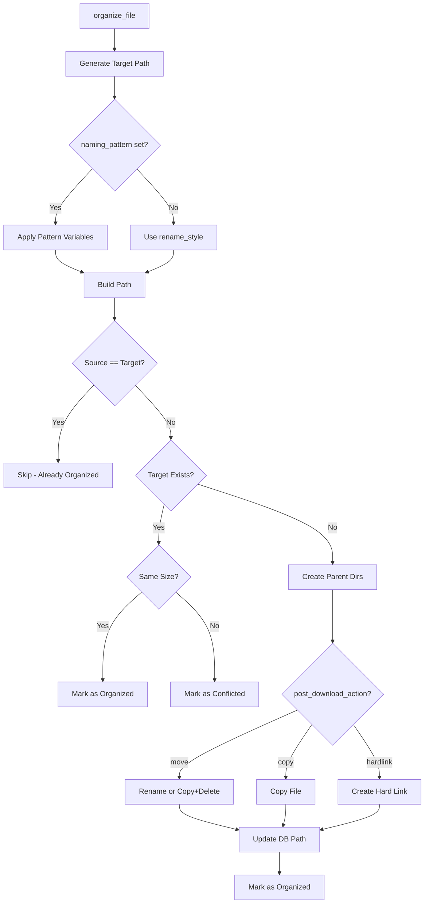

### Naming Pattern Variables

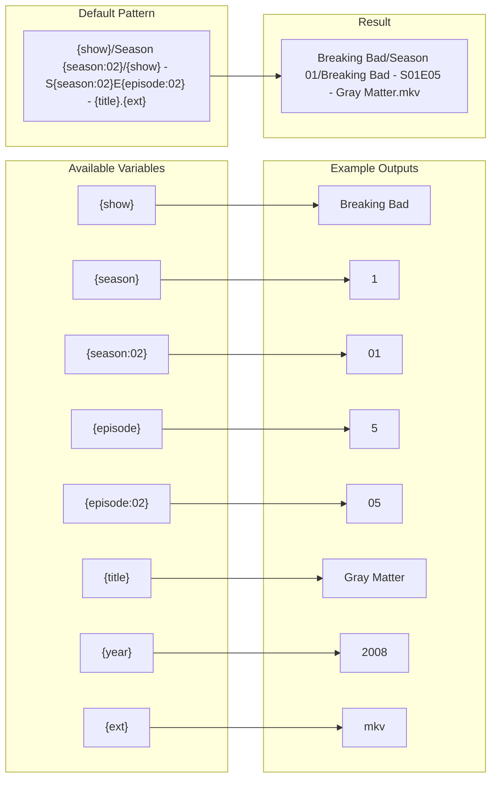

---

## Scheduled Jobs

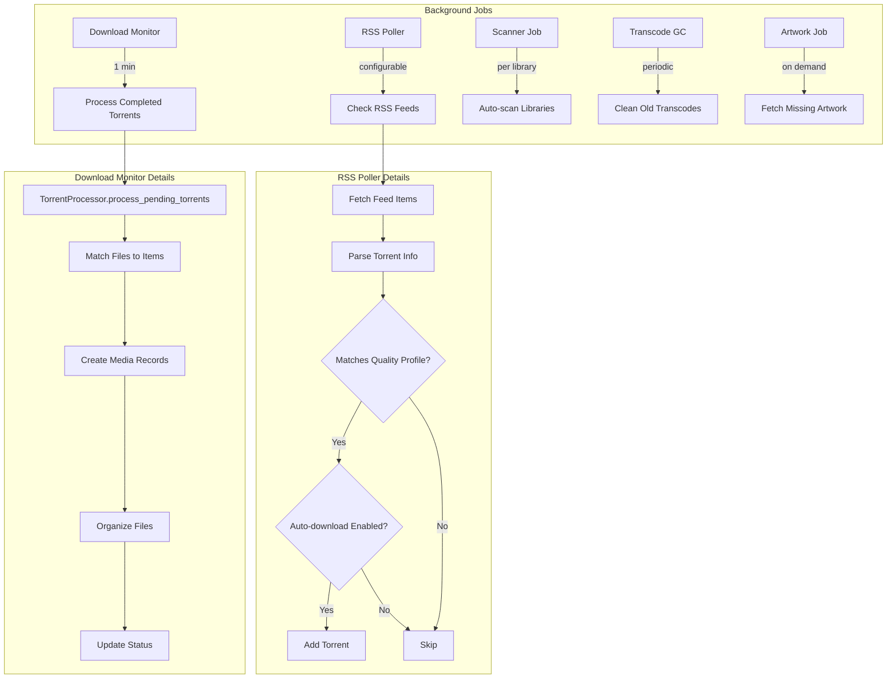

---

## Event Flow (Subscriptions)

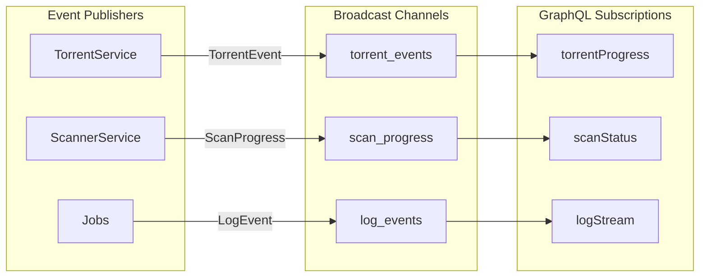
