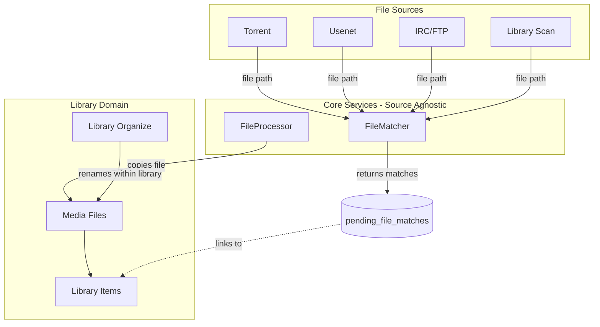
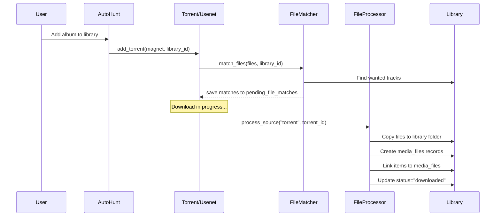

# Media Pipeline Architecture

This document defines the unified media pipeline for Librarian - how files flow from any download source into organized libraries.

## Core Principles

1. **Source-agnostic matching** - The same matching logic handles files from torrents, usenet, IRC, FTP, or library scans
2. **Always COPY, never move** - Files are always copied from download folders to library folders
3. **Library owns files** - Unlinking a download source never affects library files
4. **Quality is verified, not assumed** - Every file is analyzed with FFprobe to determine true quality
5. **No auto-delete files** - Move conflicts to a designated folder, never auto-delete user files
6. **Partial fulfillment is OK** - Downloading 8 of 12 album tracks is valid; remaining 4 stay "wanted"
7. **Status reflects reality** - "downloading" means in download queue, "downloaded" means file in library folder

---

## Architecture Overview

The matching and processing logic is **source-agnostic** - implemented in two central services:



**Key Services:**

| Service | Location | Responsibility |
|---------|----------|----------------|
| `FileMatcher` | `backend/src/services/file_matcher.rs` | THE ONLY place matching logic exists |
| `FileProcessor` | `backend/src/services/file_processor.rs` | THE ONLY place file copying happens |
| `LibraryOrganizer` | `backend/src/services/organizer.rs` | Renames files within library folder only |

---

## Item Status Lifecycle

### Episode/Track/Chapter/Movie Status Values

| Status | Meaning | Triggers |
|--------|---------|----------|
| `missing` | No file exists, hasn't aired yet (for episodes) | Default for future content |
| `wanted` | Aired/released, no file, actively looking | Air date passed, monitored=true |
| `downloading` | Matched to a pending download | File matched via FileMatcher |
| `downloaded` | File exists in library folder | File copied via FileProcessor |
| `suboptimal` | Has file but below quality target | FFprobe detects quality below target |
| `ignored` | User explicitly skipped | Manual action |

### Status Transitions

```
                    ┌──────────────────────────────────────────────────┐
                    │                                                  │
                    ▼                                                  │
┌─────────┐    ┌─────────┐    ┌─────────────┐    ┌────────────┐    │
│ missing │───▶│ wanted  │───▶│ downloading │───▶│ downloaded │    │
└─────────┘    └─────────┘    └─────────────┘    └────────────┘    │
     │              │                                   │           │
     │              │                                   ▼           │
     │              │              ┌────────────┐   ┌───────────┐   │
     │              └─────────────▶│ suboptimal │◀──│ (upgrade) │───┘
     │                             └────────────┘   └───────────┘
     │                                   │
     └───────────────────────────────────┘
                        │
                        ▼
                  ┌─────────┐
                  │ ignored │
                  └─────────┘
```

### Key Rules

- **missing → wanted**: When air_date passes (for episodes) or immediately (for movies/albums added)
- **wanted → downloading**: When FileMatcher creates a match for this item
- **downloading → downloaded**: When FileProcessor copies the file to library
- **downloaded → suboptimal**: When FFprobe reveals quality below target
- **suboptimal → wanted**: Only via explicit user action (or auto-upgrade if implemented)
- **Any → ignored**: Explicit user action only

---

## The Unified Pipeline

### Entry Points

All content enters through one of these paths:

1. **Auto-Hunt** - System searches indexers for wanted items (torrent or usenet)
2. **RSS Feed** - System polls feeds and matches against wanted items  
3. **Manual Hunt** - User searches on `/hunt` page, may or may not link to library/item
4. **Direct Add** - User adds magnet/URL/NZB directly, no library context
5. **Library Scan** - System discovers files already in library folder

### Pipeline Flow



### Phase 1: Download Acquisition

When a download is added:

1. **Create download record** - `torrents` or `usenet_downloads` table
2. **Get file list** - From torrent metadata or NZB
3. **Match files** - `FileMatcher.match_files()` finds matching wanted items
4. **Save matches** - Creates `pending_file_matches` records
5. **Update item status** - Sets matched items to "downloading"
6. **Set active_download_id** - Links item to the pending match for progress display

### Phase 2: Post-Download Processing

When download completes (triggered by Download Monitor Job):

1. **Process pending matches** - `FileProcessor.process_source()` processes all uncopied matches
2. **For each match:**
   - Determine destination path using library naming pattern
   - Copy file from download folder to library folder
   - Create `media_file` record with new path
   - Link item to media_file
   - Update item status to "downloaded"
   - Clear `active_download_id`
   - Queue file for FFprobe analysis

### Phase 3: Library Scanning (Alternate Entry)

When scanning existing library files:

1. **Walk directory tree** - Find all media files
2. **For new files** - Use `FileMatcher.match_file()` to find matching wanted item
3. **If matched** - Use `FileProcessor.link_existing_file()` to create media_file and link
4. **If not matched + auto_add_discovered** - Create new item from file metadata

---

## Database Schema

### `pending_file_matches` (Source-Agnostic)

Replaces the old `torrent_file_matches` table with a unified, source-agnostic design:

```sql
pending_file_matches (
    id UUID PRIMARY KEY,
    user_id UUID NOT NULL,
    
    -- Source file info (works for any source)
    source_path TEXT NOT NULL,           -- Full path to source file
    source_type VARCHAR(20) NOT NULL,    -- 'torrent', 'usenet', 'scan', 'manual'
    source_id UUID,                      -- torrent_id, usenet_download_id, etc.
    source_file_index INTEGER,           -- For multi-file sources (torrents)
    file_size BIGINT NOT NULL,
    
    -- Match target (only one set per row)
    episode_id UUID REFERENCES episodes(id) ON DELETE CASCADE,
    movie_id UUID REFERENCES movies(id) ON DELETE CASCADE,
    track_id UUID REFERENCES tracks(id) ON DELETE CASCADE,
    chapter_id UUID REFERENCES chapters(id) ON DELETE CASCADE,
    
    -- Match metadata
    match_type VARCHAR(20) DEFAULT 'auto',  -- 'auto', 'manual'
    match_confidence DECIMAL(3,2),
    
    -- Parsed quality info (from filename)
    parsed_resolution VARCHAR(20),
    parsed_codec VARCHAR(50),
    parsed_source VARCHAR(50),
    parsed_audio VARCHAR(100),
    
    -- Processing status
    copied_at TIMESTAMPTZ,               -- null = not yet copied
    copy_error TEXT,                     -- error if copy failed
    
    created_at TIMESTAMPTZ DEFAULT NOW(),
    updated_at TIMESTAMPTZ DEFAULT NOW()
);

-- Index for finding matches by source
CREATE INDEX idx_pending_file_matches_source ON pending_file_matches(source_type, source_id);
```

### `active_download_id` on Library Items

For showing download progress:

```sql
-- Links to pending_file_matches - works for torrent, usenet, etc.
ALTER TABLE tracks ADD COLUMN active_download_id UUID REFERENCES pending_file_matches(id) ON DELETE SET NULL;
ALTER TABLE episodes ADD COLUMN active_download_id UUID REFERENCES pending_file_matches(id) ON DELETE SET NULL;
ALTER TABLE movies ADD COLUMN active_download_id UUID REFERENCES pending_file_matches(id) ON DELETE SET NULL;
ALTER TABLE chapters ADD COLUMN active_download_id UUID REFERENCES pending_file_matches(id) ON DELETE SET NULL;
```

---

## GraphQL API

### Queries

```graphql
# Get pending matches for any source
query PendingFileMatches($sourceType: String!, $sourceId: String!) {
  pendingFileMatches(sourceType: $sourceType, sourceId: $sourceId) {
    id
    sourcePath
    sourceType
    episodeId movieId trackId chapterId
    matchConfidence
    copied copiedAt copyError
  }
}
```

### Mutations

```graphql
# Re-match all files from a source
mutation RematchSource($sourceType: String!, $sourceId: ID!, $libraryId: ID) {
  rematchSource(sourceType: $sourceType, sourceId: $sourceId, libraryId: $libraryId) {
    success matchCount error
  }
}

# Process pending matches (copy files to library)
mutation ProcessSource($sourceType: String!, $sourceId: ID!) {
  processSource(sourceType: $sourceType, sourceId: $sourceId) {
    success filesProcessed filesFailed error
  }
}

# Manually set a match target
mutation SetMatch($matchId: ID!, $targetType: String!, $targetId: ID!) {
  setMatch(matchId: $matchId, targetType: $targetType, targetId: $targetId) {
    success error
  }
}

# Remove a specific match
mutation RemoveMatch($matchId: ID!) {
  removeMatch(matchId: $matchId) {
    success error
  }
}
```

---

## File Matching Logic

### Match Priority

When matching a file to wanted items:

1. **Explicit link** - If user/auto-hunt provided item_id, use it (trust selection)
2. **Library context** - If library_id provided, only match within that library
3. **All libraries** - If no context, search all user's libraries with auto_download=true

### Match Criteria

For a file to match an item:

```rust
fn match_file(&self, file: &FileInfo, libraries: &[Library]) -> Option<FileMatchResult> {
    // 1. Determine file type (video vs audio)
    let is_video = is_video_file(&file.path);
    let is_audio = is_audio_file(&file.path);
    
    // 2. Skip samples
    if is_sample_file(&file.path, file.size) {
        return Some(FileMatchResult::Sample);
    }
    
    // 3. Parse filename for metadata
    let parsed = filename_parser::parse(&file.path);
    
    // 4. Find matching item based on file type
    if is_video {
        try_match_episode(parsed) || try_match_movie(parsed)
    } else if is_audio {
        try_match_track(parsed) || try_match_chapter(parsed)
    }
}
```

### Fuzzy Matching

Uses `rapidfuzz` for intelligent title matching:

- Show name similarity threshold: 80%
- Track title similarity threshold: 60%
- Handles common variations (punctuation, "The" prefix, etc.)

---

## Implementation Modules

| Module | Purpose | Status |
|--------|---------|--------|
| `file_matcher.rs` | Source-agnostic file matching (THE ONLY matching code) | ✅ Complete |
| `file_processor.rs` | Source-agnostic file copying (THE ONLY copy code) | ✅ Complete |
| `pending_file_matches.rs` | Database repository for pending matches | ✅ Complete |
| `organizer.rs` | Library-only file organization | ✅ Complete |
| `quality_evaluator.rs` | FFprobe quality verification | ✅ Complete |
| `scanner.rs` | Library scanning | 🟡 Needs FileMatcher integration |
| `torrent_completion_handler.rs` | Torrent add/complete handling | ✅ Complete |
| `download_monitor.rs` | Scheduled processing job | ✅ Complete |
| `auto_hunt.rs` | Auto-hunt service | ✅ Complete |

---

## Implementation Status

### Completed

- ✅ `pending_file_matches` database table (source-agnostic)
- ✅ `active_download_id` on library items
- ✅ `FileMatcher` service with fuzzy matching
- ✅ `FileProcessor` service with copy and link
- ✅ GraphQL mutations: rematchSource, processSource, setMatch, removeMatch
- ✅ GraphQL query: pendingFileMatches
- ✅ Torrent integration (match on add, process on complete)
- ✅ Download monitor job updated
- ✅ Frontend: TorrentTable with Process/Rematch actions
- ✅ Frontend: TorrentInfoModal with copy status and remove match

### Pending

- 🟡 Scanner integration (use FileMatcher for new files)
- 🟡 Frontend: Library item progress bar when active_download_id is set
- 🟡 Frontend: Pre-existing TypeScript warnings in unrelated files

### Future Enhancements

- ⏳ Use FFprobe metadata (ID3 tags) to improve matching accuracy for audio
- ⏳ Usenet integration with new services
- ⏳ IRC/FTP download source support

---

## UI Features

### Downloads Page

| Feature | Status |
|---------|--------|
| File matches per torrent | ✅ In Info modal |
| Copy status display (Copied/Pending/Error) | ✅ Complete |
| "Process" action (copy files to library) | ✅ Complete |
| "Rematch" action (re-run matching) | ✅ Complete |
| "Remove Match" per file | ✅ Complete |

### Library Items

| Feature | Status |
|---------|--------|
| Progress bar when downloading | 🟡 Needs active_download_id integration |
| Suboptimal quality indicator | ✅ Complete |

---

## Archive Extraction

Fully implemented with support for:

| Format | Status | Tool |
|--------|--------|------|
| ZIP | ✅ | Native Rust |
| RAR (single) | ✅ | `unrar` |
| RAR (multi-part) | ✅ | `unrar` (auto-handles .r00, .r01, etc.) |
| 7z | ✅ | `7z` command |

Extraction is triggered automatically:
- After torrent completion
- After usenet download completion
- Archives extracted to `{download_path}/_extracted/`
- Original archives preserved for seeding
